# Informe Laboratorio 3 - Parte Individual
## Programación asistida para Frameworks sobre Cálculo Distribuido

##### Alumno: 

- Brunello, Florencia: florenciabrunello@mi.unc.edu.ar

## Índice 
1. [Introducción](#intro)
2. [Estrategia](#estrategia)
2. [¿Cómo se instala Spark en una computadora personal?](#intalar)
3. [¿Qué estructura tiene un programa en Spark?](#estructura)
4. [¿Qué estructura tiene un programa de conteo de palabras en diferentes documentos en Spark?](#estructuraconteo)
5. [¿Cómo adaptar el código del Laboratorio 2 a la estructura del programa objetivo en Spark?](#adaptar)
6. [¿Cómo se integra una estructura orientada a objetos con la estructura funcional de map-reduce?](#integrar)
7. [Conclusión](#conclusion)

        
### Introducción 
En el este proyecto, se llevará a cabo la re-implementación del lector automático de feeds del laboratorio 2 utilizando una arquitectura distribuida. Para lograr esto, se empleará el framework Spark y el lenguaje de programación Java. Además, se presentará el proceso de desarrollo del proyecto, utilizando estrategias basadas en ejemplos de código.

### Estrategia 
La estrategia que utilizé para llevar a cabo el laboratorio es el código de ejemplo obtenido de proyectos de ejemplo en github, kaggle y referencias del mismo proyecto Spark. Los principales fueron los siguientes: 
        https://github.com/ypriverol/spark-java8/tree/master/src/main/java/org/sps/learning/spark
        https://github.com/apache/spark/blob/master/examples/src/main/java/org/apache/spark/examples/JavaWordCount.java

### ¿Cómo se instala Spark en una computadora personal? 
Para instalar Spark en una computadora personal, usé la información que provee el siguiente repositorio de GitHub: 

https://github.com/GalvanizeDataScience/spark-install

En la sección 1.2 figura lo siguiente: 
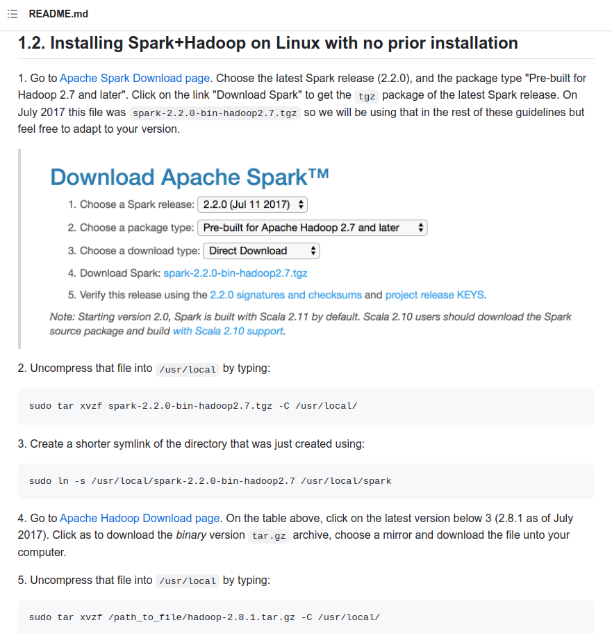
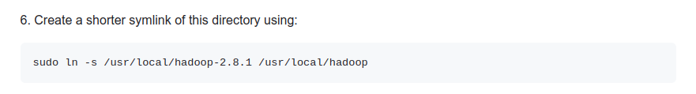

Luego, me dirigí a la página (https://spark.apache.org/downloads.html).
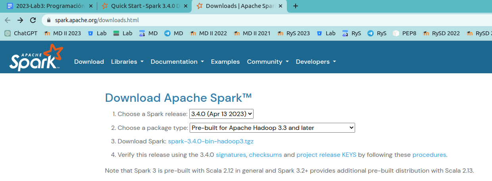
Allí hice click en el punto 3 que me llevó a la siguiente página: (https://www.apache.org/dyn/closer.lua/spark/spark-3.4.0/spark-3.4.0-bin-hadoop3.tgz).
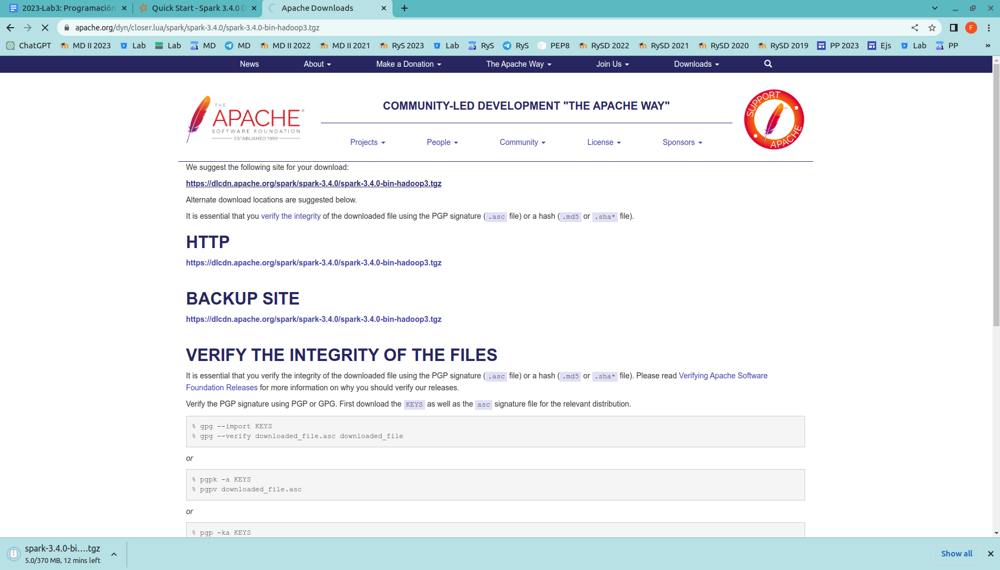
Al hacer click en el primer link (https://dlcdn.apache.org/spark/spark-3.4.0/spark-3.4.0-bin-hadoop3.tgz) comenzó a descargarse un archivo tar. 

Una vez descargado el archivo, en la página principal de Apache en la sección Java: 
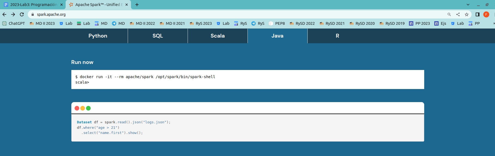
Ejecuté el comando en la terminal y obtuve lo siguiente: 
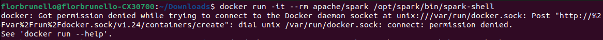
Como figuraba que era un problema "permission denied", ejecuté el mismo comando pero agregando sudo al comienzo (ya he tenido el mismo problema en otras oportunidades). Para corroborar, consulté el ChatGPT lo siguiente: 
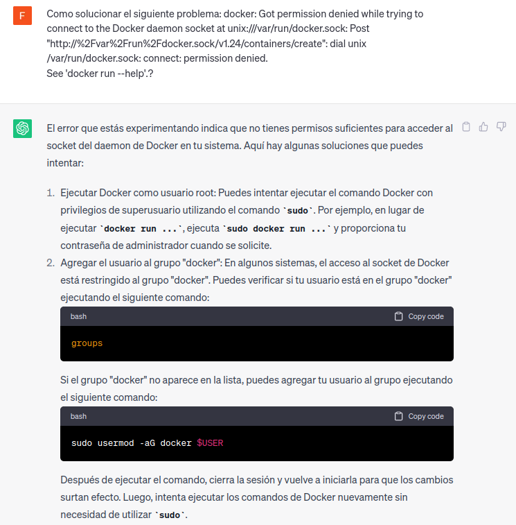

Luego de ejecutarlo con sudo, obtuve lo siguiente:
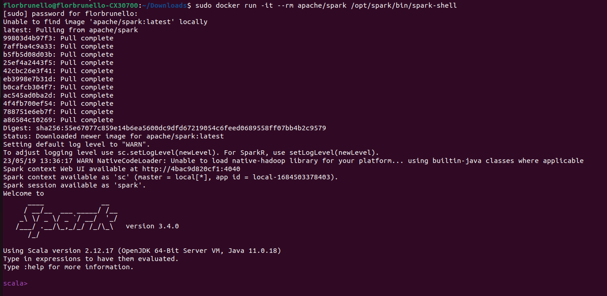

### ¿Qué estructura tiene un programa en Spark? 

Luego de ver ejemplos de tres códigos de Github, hallé carasterísticas comunes a programas en Spark (en Java). Las fuentes son las siguientes: 
1) Obtenido a partir de Kaggle, que me dirigió a un repositorio en Github:
Información en Kaggle: https://www.kaggle.com/competitions/bosch-production-line-performance/discussion/23301
Repositorio en Github: https://github.com/aaudevart/bosch-spar
2) Repositorio en Github: https://github.com/TechPrimers/spark-java-example
3) Repositorio en Github: https://github.com/julien-diener/spark-csvconverter

El análisis y la respuesta a esta pregunta es en base a pedazos de código extríados de los repositorios anteriores sumado a esta mini estructura descrita en el link 1) de Kaggle: 

- Dado que estamos trabajando en Java, en ambos ejemplo definimos packages. Luego se hace "import" de varias clases y métodos. Entre ellas, están las librerías: 
        import org.apache.spark.api.java.JavaRDD;
        import org.apache.spark.api.java.JavaSparkContext;
        import org.apache.spark.sql.SparkSession;
        import org.apache.spark.SparkConf;
Códigos de ejemplo:

    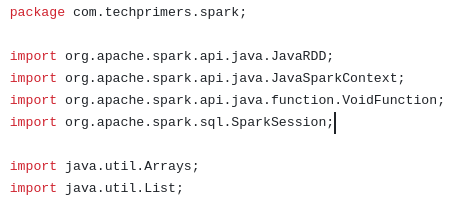
    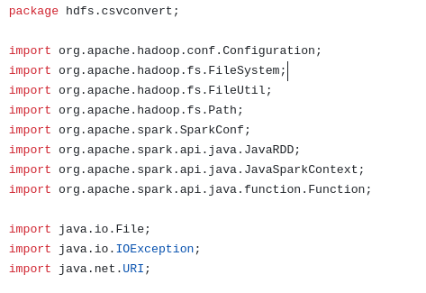
    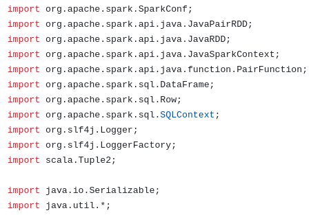

 

- Se hace un "init spark context", como se ve en el segundo ejemplo. Se puede ver que se crea un spark context usando la clase SparkConf. Además, se configuran cosas como JavaSparkContext y SQLContext. Por el nombre de los campos setName, set("spark.executor.memory") y setMaster podemos deducir que se setean el nombre de la aplicación, memoria alocada. 
Ejemplos:

    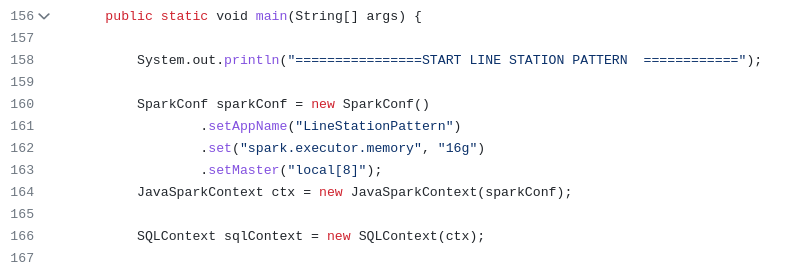
    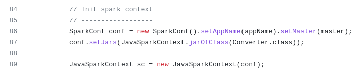

 

 

- Después, según la tarea del programa, se hace una carga de datos de diversas formas: aquí hay tres ejemlos.
Ejemplo 1: 
Vemos guardamos en la abstracción JavaRDD información extríada de un archivo. 

 
Ejemplo 2: 
En este caso, los datos se cargan a partir de una lista de enteros definidas en el mismo programa. 
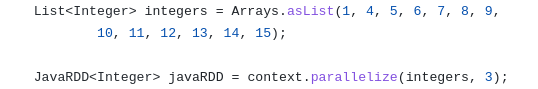
 
Ejemplo 3: 
Los datos son extraídos dada una ruta y un archivo .csv en un DataFrame (otro tipo de abstracción). 

 

- Luego se aplican las tranformaciones map (y reduce, que no figura en los ejemplos): 
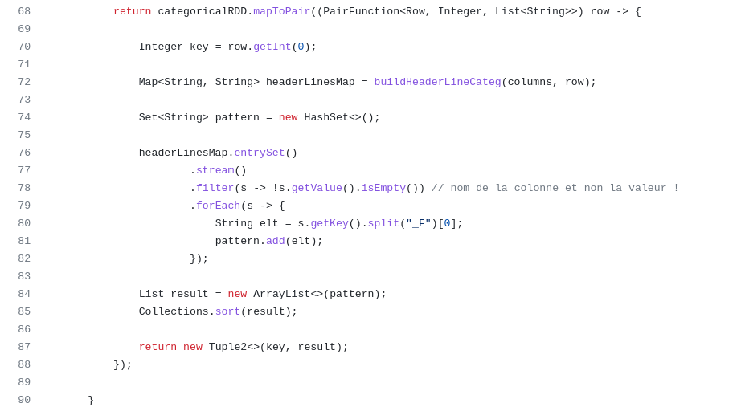

En este caso se hace una llamada a mapToPair y map. 

 

- Finalmente, se hace un stop() como en este ejemplo en la línea 39: 
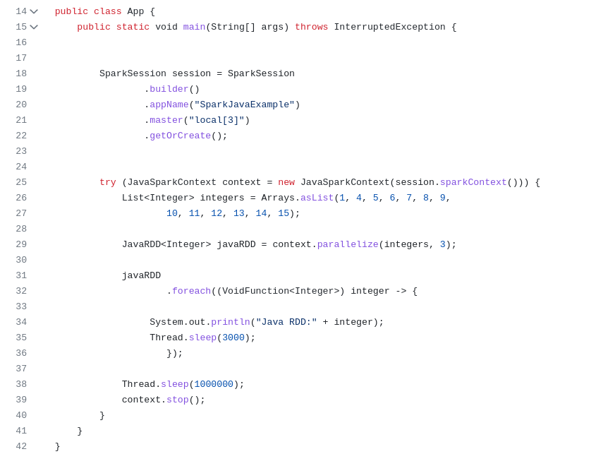

### ¿Qué estructura tiene un programa de conteo de palabras en diferentes documentos en Spark? 

Respuesta obtenida a partir del siguiente código de ejemplo: https://github.com/apache/spark/blob/master/examples/src/main/java/org/apache/spark/examples/JavaWordCount.java

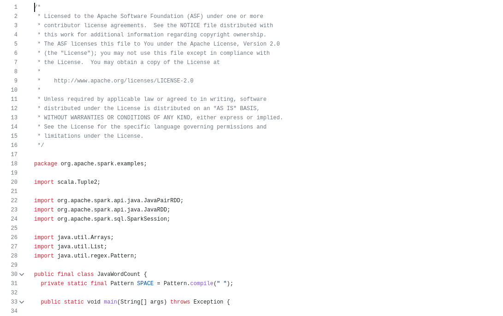
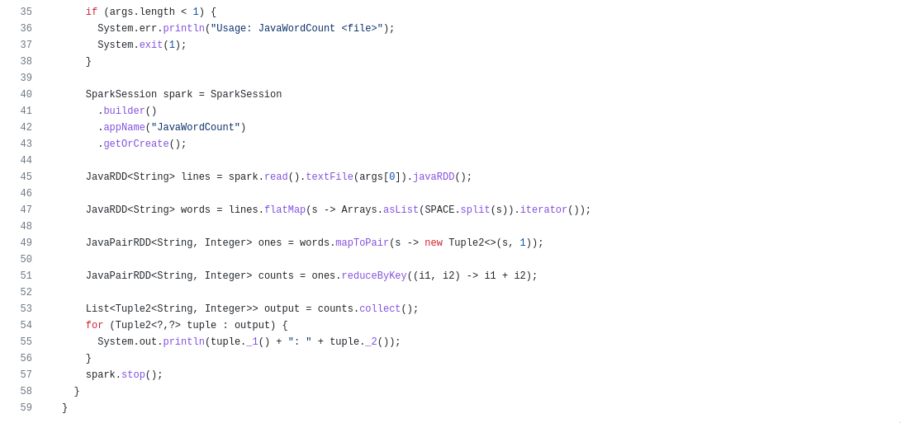

JavaWordCount.java, es un programa de conteo de palabras en Spark utilizando el lenguaje Java. Este código sigue una estructura típica de un programa de conteo de palabras en diferentes documentos en Spark y se puede describir de la siguiente manera:

Configuración de Spark: El programa comienza configurando la aplicación Spark mediante la creación de un SparkConf que define la configuración de la aplicación, como el nombre de la aplicación y las opciones de configuración del clúster.

Creación de un contexto Spark: Se crea un JavaSparkContext a partir del SparkConf para interactuar con Spark. El JavaSparkContext proporciona métodos para crear RDD y ejecutar operaciones en ellos.

Carga de datos: El programa carga los documentos de texto desde una ubicación específica utilizando el método textFile del JavaSparkContext. Este método devuelve un JavaRDD<String>, que representa un RDD de líneas de texto.

Transformación de datos: Se aplican una serie de transformaciones al RDD cargado para realizar el conteo de palabras. Estas transformaciones pueden incluir:

División de líneas en palabras: Se utiliza el método flatMap para dividir cada línea en palabras individuales y se crea un nuevo RDD de palabras.
Mapeo de palabras: Se asigna un valor de 1 a cada palabra utilizando el método mapToPair, que crea un RDD de pares clave-valor donde la clave es la palabra y el valor es 1.
Reducción por clave: Se realiza una reducción por clave utilizando el método reduceByKey para agregar los recuentos de las palabras.
Acciones: Finalmente, se ejecutan acciones en el RDD transformado para obtener los resultados del conteo de palabras. En el ejemplo proporcionado, se utiliza el método collect para recopilar todos los pares clave-valor en el RDD y se imprimen en la consola.

### ¿Cómo adaptar el código del Laboratorio 2 a la estructura del programa objetivo en Spark? 

Para poder adaptar el código del Laboratorio 2 hice modificaciones en el archivo Application.java. Tomé como referencia principal el repositorio de GitHub: https://github.com/ypriverol/spark-java8/blob/master/src/main/java/org/sps/learning/spark/basic/SparkWordCount.java. (En cada ítem las capturas de pantalla son referidas al mismo, salvo que se diga lo contrario).

- Librerías: 

    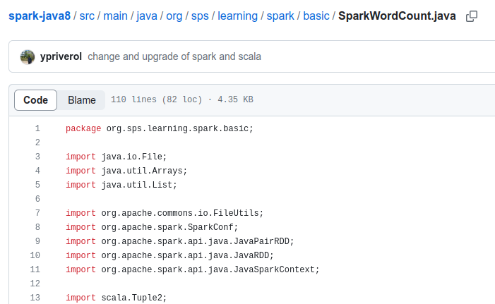
    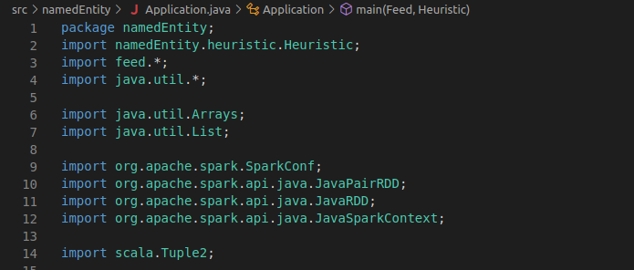

 

En cuanto a las librerías a utilizar, la única diferencia con el programa modelo es que no importé lo referido a File (java.io.File y org.apache.commons.io.FileUtils) ya que eran innecesarias. 
 

- Crear un JavaSparkContext object:

    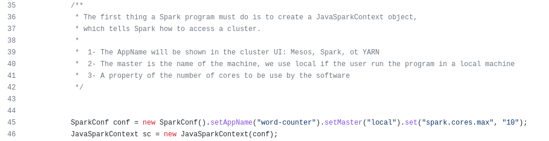
    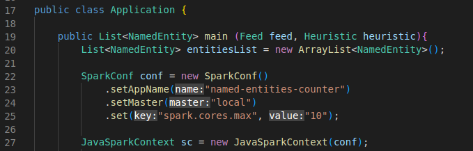

 
Como lo explica el código modelo, lo siguiente que hice fue crear un objeto de la clase JavaSparkContext. Este tiene tres atributos: AppName, Master (local pues utilice mi computadora personal) y la cantidad de núcleos a usar. 
 
 

- Obtener título y texto de los artículos: 
A partir del código del Laboratorio 2 reemplacé el tipo String por el tipo JavaRDDString para así poder usar el método parallelize.  https://github.com/ypriverol/spark-java8/blob/master/src/main/java/org/sps/learning/spark/basic/SparkAvg.java

        for (Article article : feed.getArticleList()) {
            String text = article.getTitle();
            text = text + ". " + article.getText();
            ...

    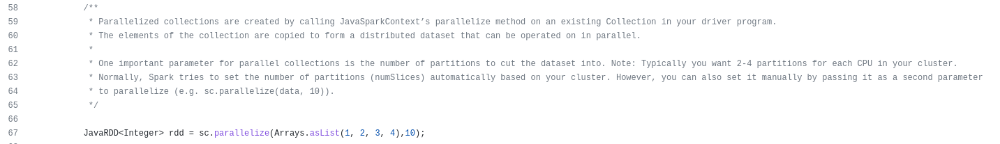
    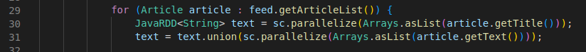

 
 

- Obtener lista de palabras, filtrar entidades nombradas y añadirlas a la entitiesList:

    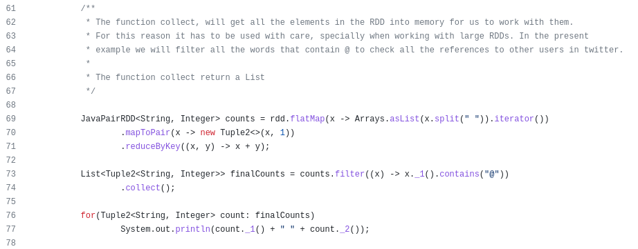
    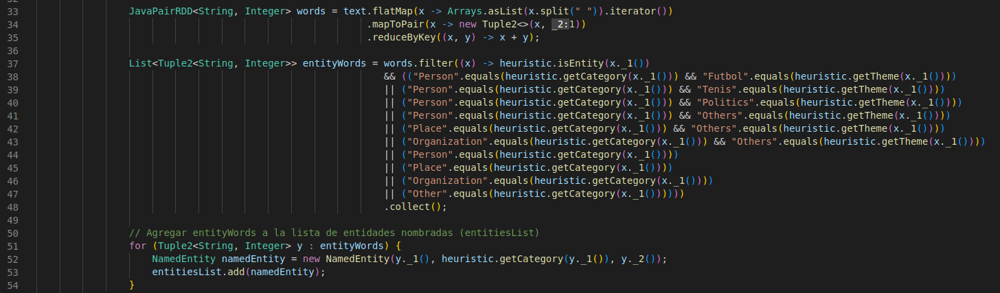

Este código de ejemplo, obtenido de https://github.com/ypriverol/spark-java8/blob/master/src/main/java/org/sps/learning/spark/twitter/SparkTweetsWordCount.java
La modificación que tuve que hacer es .contains("@"). Me basé en la estructura del programa del laboratorio 2 en el que usamos if y else para hallar entidades nombradas. En este caso, decidí hacer varias conjunciones.  
Por otro lado, en el último for, en vez de imprimir los resultados, los agregué a la lista de entidades nombradas para luego reducirla. De manera similar al laboratorio anterior donde por cada entidad nueva encontrada se creaba una instancia de la clase y se la agregaba a la lista de resultado. 
 
 

- Uso de Map y Reduce:

    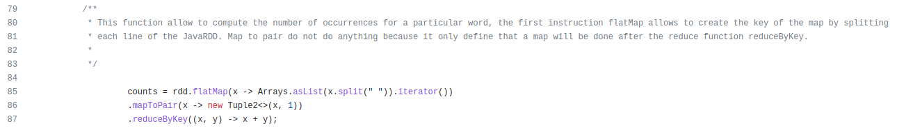
    

- sc close
 

- Finalmente, hice las siguientes modificaciones en los archivos NamedEntity.java y QuickHeuristic.java. Serialize. 
Obtuve los siguientes errores (primera imagen) y lo corregí al agregar lo que se muestra en la segunda imagen: 

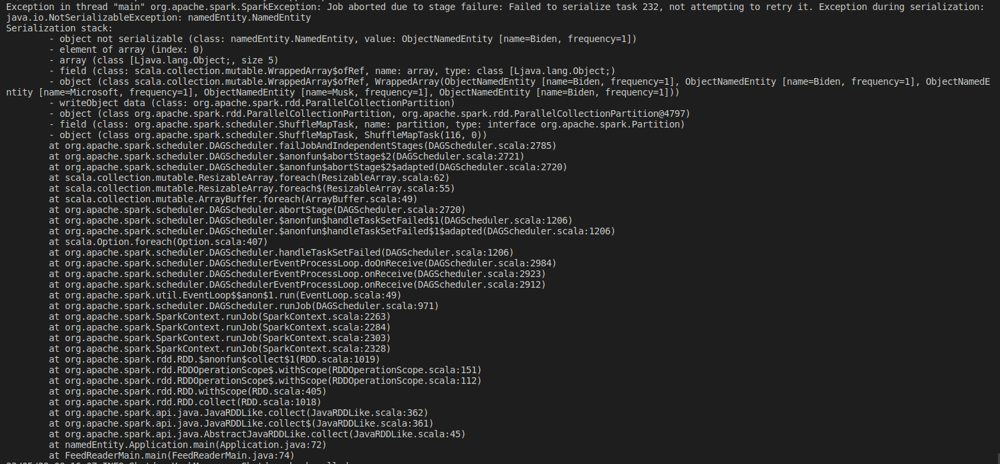
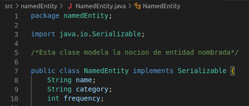
 
Y lo mismo para QuickHeuristic:
 
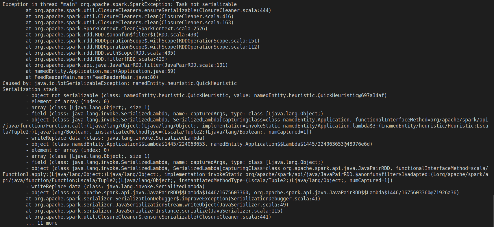
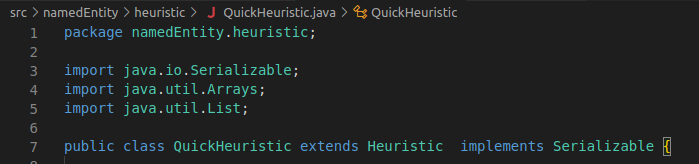
        

### ¿Cómo se integra una estructura orientada a objetos con la estructura funcional de map-reduce? 

En este caso, Spark para Java proporciona bibliotecas y marcos específicos para facilitar la integración de la programación 
orientada a objetos y map-reduce. Para lograr esto, se integraron librerías (explicitadas en la respuesta anterior), y se creó un contexto 
de Spark (JavaSparkContext). 

### Conclusión 
En este laboratorio detallé el proceso de re-implementación del lector automático de feeds. Se utilizaron ejemplos de código para comprender y adaptar el código anterior al entorno de Spark, demostrando la capacidad de integrar la programación orientada a objetos con la estructura funcional de map-reduce en Spark. Gracias a bibliotecas y marcos proporcionados por el framework esta integración permite aprovechar las ventajas de ambos enfoques y facilita el desarrollo de aplicaciones distribuidas.