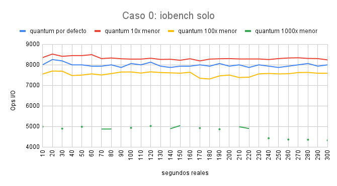
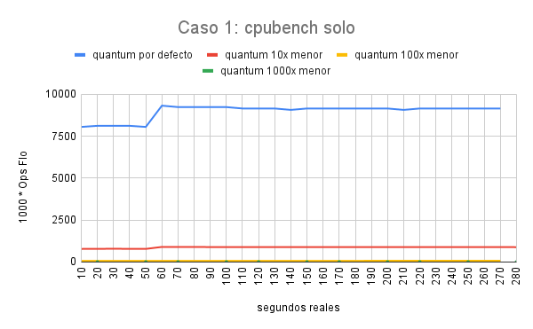
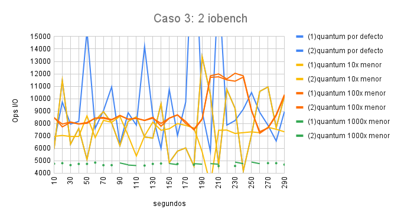
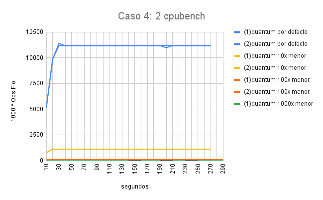

# Informe Laboratorio 3 - Planificador de procesos

##### Integrantes del grupo: 

- Brunello, Florencia: florenciabrunello@mi.unc.edu.ar
- Bustos, Franco: franco.bustos@mi.unc.edu.ar
- Caldara, Marí­a Emilia: maemiliacaldara@mi.unc.edu.ar
- Ferrero, Andrés: andres.ferrero@mi.unc.edu.ar

## Índice 
1. [Introducción](#introducción)
2. [Compilación](#compilación)
3. [Planificador de procesos](#planificador)
    - [Primera Parte](#primera-parte)
    - [Segunda Parte](#segunda-parte)
    - [Tercera Parte](#tercera-parte)
    - [Cuarta Parte](#cuarta-parte)
4. [Técnicas y Herramientas de Programación](#técnicas)
5. [Conclusiones](#conclusiones)

### Introducción
Este trabajo se basa en el análisis de datos, más concretamente, en el análisis de las métricas de dos programas de usuario: cpubench y iobench. Cpubench cuenta cantidad de operaciones cada 100 interrupciones de tiempo (aprox. 10 segundos), y el iobench cuenta la cantidad de operaciones i/o con la misma cantidad de interrpuciones. Además, se realiza la implementación del planificador MLFQ. 
Para ello fue necesario analizar código y datos, asignar prioridades a los procesos, y luego pensar en las posibles formas de implementar MLFQ.
A continuación, se detallarán aspectos de cada parte del trabajo. 

### Compilación
El siguiente trabajo se compila con el comando _make_, y luego _make CPUS=1 qemu_. Debemos hacerlo de este modo para poder tomar las mediciones correctamente. 

### Planificador de procesos
#### Primera Parte: Estudiando el planificador de xv6

1) ¿Qué política de planificación utiliza xv6 para elegir el próximo proceso a ejecutarse? 
El sistema operativo xv6 utiliza la política de planificación Round Robin. Dedujimos esto a partir de la función _scheduler()_, la cual recorre un arreglo de procesos llamado 'proc' que almacena estructuras de datos de tipo _struct proc_ y los ejecuta por un segmento de tiempo (quantum). 
Para seleccionar el proceso a ser ejecutado, se chequea el primero cuyo estado sea RUNNABLE. Luego se cambia su estado a RUNNING y ocurre un context switch, implementado en la función _swtch_. Una vez hecho el context switch, comienza a ejecutarse el proceso seleccionado y eventualmente, luego de un período de tiempo, su estado cambiará para así elegir el siguiente proceso con estado RUNNABLE.

2a) ¿Cuánto dura un quantum en xv6?
Un quantum dura 1000000 ciclos, aproximadamente 1/10th segundos en qemu. Esta información la obtuvimos de la función _timeinit()_ en start.c, la cual es llamada en la función que analiza los traps a kernel: _kerneltrap()_. Esta última distingue los casos en los que se realizan traps, entre ellos, las interrupciones por tiempo.
Si ocurre una interrupción de tiempo y hay un proceso en estado RUNNING, se llama a la función _yield()_ y se cambia el estado del proceso para que se planifique otro. 

2b) ¿Cuánto dura un cambio de contexto en xv6?
En base a mediciones tomadas, pudimos deducir que dura aprox. entre 300-500 ciclos. El estudio que realizamos fue el siguiente: fuimos recortando el quantum, y modificamos cpubench (calculamos la variable MINTICKS en base al interval, y sacamos el (ops / 1000) que tiene el programa a la hora de imprimir los datos). Ejecutamos un cpubench solo, mientras con CTRL+P vimos cómo el proceso estaba en RUNNABLE y no se ejecutaba nunca(i.e imprimir datos) ya que todo el tiempo del quantum era consumido por el context switch.    

2c) ¿El cambio de contexto consume tiempo de un quantum?
El cambio de contexto si consume tiempo de un quantum, pues las interrupciones por tiempo se reciben a través de un trap y dependen exclusivamente del hardware. El quantum está dado por ciclos de CPU, por lo tanto, al hacer context switch se consumen dichos ciclos. 

2d) ¿Hay alguna forma de que a un proceso se le asigne menos tiempo?
No hay forma de que se le asigne menos tiempo a un proceso, pues el scheduler está implementado para que cada proceso se ejecute por un tiempo determinado, por un quantum.  
Una forma de que a un proceso se le asigne menos tiempo implicaría modificar el quantum, pero esto puede mejorar para ciertos tipos de programas y empeorar a otros. 

#### Segunda Parte: Cómo el planificador afecta a los procesos
Nos concentraremos en cada caso, variando el escenario. Utilizamos como unidad de medida 10 segundos, como es por defecto en el escenario 0. Es decir que cada proceso, aproximadamente cada 10 segundos nos devuelve la cantidad de operaciones que realizó.
##### Caso 0
Un único proceso iobench. Es el caso ideal para cada proceso iobench, pues no tienen que compartir la CPU con ningún otro proceso, se espera que en este caso es donde mas operaciones por 10 segundos puede llega a realizar.
###### Escenario 0
Un quantum bastante grande para un proceso iobench, como hace solicitudes IO y queda en sleep, siempre le sobra quantum pues es muy pequeño el uso que le da al CPU. Al no tener que compartir el CPU con otro proceso, esta CPU se queda "esperando" a que el proceso vuelva a runeable, e inmediatamente lo pasa a run.
###### Escenario 1
Un quantum 10 veces mas pequeño. Como anteriormente el quantum sobraba para el poco uso de CPU que le da el proceso, acá sucede más de lo mismo. Por mas que ahora haya menos quantum y esto implique que en 10 segundos haya 10 veces mas interrupciones, los procesos iobench no se ven perjudicados. Es más, en este caso hasta se ven beneficiados, y no estamos seguros el porqué.
Mientras nuestro proceso está en sleep, el procesador no está corriendo ningún otro proceso, y es una trap distinto al time interrupt el que indica cuando termina de hacer IO, por lo que una mayor cantidad de time interrupts no necesariamente debería de hacer que el procesador atienda mas rápido al proceso.
###### Escenario 2
Un quantum 100 veces mas pequeño. Acá si ya se llega a ver afectado este tipo de proceso, la cantidad de interrupciones que hay por tiempo hacen que el proceso no aproveche al máximo a la CPU en los 10 segundos que muestra los resultados, haciendo que la cantidad de operaciones que pueda realizar se vean afectados negativamente.
###### Escenario 3
Un quantum 1000 veces mas pequeño. Acá la cantidad de interrupciones que hay en los 10 segundos es significativa, al punto de verse reducido casi a la mitad la cantidad de operaciones que puede realizar, comparada con el quantum original. Pensamos que se debe a que muchas de estas interrupciones que se producen suceden cuando el proceso utiliza la CPU, así perdiendo poco pero múltiples veces tiempo de ejecución.

##### Caso 1
Un único proceso cpubench.
###### Escenario 0
Quantum por defecto. Similar a iobench. Es el caso más favorable. El proceso usa la totalidad de su quantum para ejecutar la mayor cantidad de Koperaciones. No tiene que hacer context switch así que casi no pierde tiempo al terminar un quantum y empezar a correr de nuevo.
###### Escenario 1
Un quantum 10 veces mas pequeño. Se puede ver como, al reducir el tiempo de ejecución, y una mayor cantidad de interrupciones, la cantidad de ops que puede realizar son muchísimas menos. 
###### Escenario 2
Un quantum 100 veces mas pequeño. Similar a escenario uno, ahora los cambios son más drásticos.
###### Escenario 3
Un quantum 1000 veces mas pequeño. Es el caso extremo. Apenas llega a hacer 2k operaciones en 10 segundos.

##### Caso 2
Dos procesos al mismo tiempo. iobench + cpubench.
###### Escenario 0
Quantum por defecto. En este caso tenemos muchas Kops de cpubench, y muy pocas i/o de iobench. Esto sucede ya que, con este quantum, es lo suficientemente grande para que cpubench se ejecute por un tiempo interesante. Mientras que iobench tiene un uso del cpu corto(probablemente menor al quantum muchas veces), y ya se bloquea cuando salta a i/o. Al bloquearse este, cpubench vuelve a correrse, e iobench queda esperando a que termine todo el quantum de cpubench (que sabemos que lo utiliza completo).
###### Escenario 1
Un quantum 10 veces mas pequeño. Ahora vemos qué tendencia toma cada proceso. Para cpubench, baja la cant. de ops, por el quantum más limitado. Pero para iobench, aumenta, ya que espera menos tiempo que antes para volver a ejecutarse luego de ponerse en ready al volver de i/o.
###### Escenario 2
Un quantum 100 veces mas pequeño. Se repite lo explicado antes, en mayor magnitud. Curiosamente, este es el caso más favorable para iobench. Probablemente suceda porque este quantum "encaja" mejor que el resto para el tiempo que tardan las ops de i/o.
###### Escenario 3
Un quantum 1000 veces mas pequeño. Casi no llega a ejecutar operaciones para cpubench. Como el context switch usa tiempo del quantum (y sabiendo que se toma un tiempo en estabilizar la ejecución del proceso después de un cambio de contexto), el tiempo real que le queda de ejecución es muy poco. 
Ahora, iobench baja la cantidad de i/o's comparado con el anterior quantum, pero sigue siendo bastante más grande que con los primeros dos quantums.

.png "Caso 2: iobench + cpubench(gráfico iobench)")

.png "Caso 2: iobench + cpubench(gráfico cpubench)")

##### Caso 3
Dos procesos iobench en paralelo. Es el caso con resultados más inestables (Ver gráfico).
###### Escenario 0
Quantum por defecto. Se nota una gran disparidad de resultados entre cada proceso. Esto sucede ya que los dos están accediendo a i/o todo el tiempo, entonces puede pasar que mientras uno está usando cpu el otro esté en i/o durante un tiempo prolongado. 
###### Escenario 1
Un quantum 10 veces mas pequeño. El comportamiento es similar al escenario 0. La única diferencia es que baja la cantidad de i/o que realiza cada proceso. Esto sucede ya que al tener un quantum más corto, puede pasar que un proceso empiece a usar la cpu, pero el quantum corto no le dé el tiempo suficiente como para solicitar i/o, entonces tenga que esperar a que el otro proceso termine para continuar la ejecución.
###### Escenario 2
Un quantum 100 veces mas pequeño. Una vez más, curiosamente los resultados se estabilizan. Suponemos que sucede porque este quantum le "encajó" bien a los procesos, por eso se ejecutan de manera más "pareja". Con respecto al promedio de los resultados, sigue disminuyendo por lo explicado anteriormente.
###### Escenario 3
Un quantum 1000 veces mas pequeño. Similar al escenario 3. El total de los resultados es cada vez más bajo.

##### Caso 4
Dos procesos cpubench en paralelo. Es un caso muy extraño. Sobre todo si comparamos la cantidad de Kops que da este caso, contra el caso 1 (un proc. cpubench solo).
Los resultados en este caso están muy parejos con respecto a cada proceso, son casi iguales. Tiene sentido ya que cpubench es un programa que utiliza únicamente cpu y cada proc. es cortado únicamente por el quantum. Entonces es idéntico el tiempo que corre cada proceso. Lo que no podemos explicar es porqué ahora que tenemos dos procesos en paralelo, se ejecutan todavía más Kops que cuando corremos un único proceso cpubench. Esto sucede en todos los escenarios. Siempre es mayor en este caso 4 que en el caso 1.
###### Escenario 0
Quantum por defecto. Arranca con resultados bajos pero luego crece. La cantidad de ops. que ejecuta cada proc. es altísima, bastante más que cuando se corrió un único proceso.
###### Escenario 1
Un quantum 10 veces mas pequeño. Caen drásticamente las Kops de cada proceso. Esto sucede ya que el quantum es más chico, entonces hay cada vez más interrupciones de tiempo, y sumando lo que lleva hacer un context switch, los procesos tienen cada vez menor tiempo de ejecución.
###### Escenario 2
Un quantum 100 veces mas pequeño. Las Kops por proceso son cada vez menores, sucede lo mismo que anteriormente.
###### Escenario 3
Un quantum 1000 veces mas pequeño. Caso borde. El quantum que se le da a cada proceso es tan chico, que sumado al tiempo que lleva hacer un context switch, el tiempo que le queda de ejecución real a cada proceso es muy corto.

#### Tercera Parte:  Rastreando la prioridad de los procesos
La tercera parte consiste en la asignación de prioridades a los procesos, con el fin de poder usar esto para implementar el planificador. Los requisitos dados en el enunciado eran los siguientes:

- Cuando un proceso se inicia, su prioridad será máxima.

- Descender de prioridad cada vez que el proceso pasa todo un quantum realizando cómputo.

- Ascender de prioridad cada vez que el proceso se bloquea antes de terminar su quantum. Nota: Este comportamiento es distinto al del MLFQ del libro.

Para poder asignarle prioridades, se modificó _struct proc_, agregando dos campos nuevos: priority y chosen. La primera de ellas indica la prioridad del proceso, y la segunda las veces que fue elegido por el scheduler.
De esta manera, en la función _allocproc()_ cada vez que entra un nuevo proceso al sistema, se le asigna la máxima prioridad, dada por NPRIO-1. 
Para decrementar la prioridad cada vez que se termina un quantum, se modificó la función _usertrap()_, en el caso donde las interrupciones se hacen por tiempo. 
Para aumentar la prioridad cada vez que el proceso termina antes que el quantum, es decir, se bloquea,  se modificó la función _sleep()_. 
Cada vez que un proceso se pone en estado RUNNING, entonces se suma el campo chosen.

Para chequear si las prioridades que estaban tomando los procesos se realizaban correctamente, se modificó _procdump()_. De esta manera, con CTRL+P podemos ver el estado de los procesos, la prioridad de cada uno y cuantas veces fueron elegidos por el scheduler.

#### Cuarta Parte: Implementando MLFQ
##### Caso 0
Un único proceso iobench. 
###### Escenario 0, 1, 2, 3
Es similar a la segunda parte en funcionamiento, pues al ser un solo proceso, el scheduler siempre lo va a elegir. Se nota un menor rendimiento en cuanto a la cantidad de operaciones, suponemos que se debe a que el nuevo scheduler es mas complejo y por lo tanto en cada interrupción, este ocupa mayor tiempo (y por lo tanto hay menos tiempo para hacer operaciones). Los distintos escenarios son análogos, pues se observan comportamientos similares.

.png "iobench solo (mlfq)")

##### Caso 1
Un único proceso cpubench.
###### Escenario 0, 1, 2, 3
También es análogo al caso 0, acá el rendimiento de las operaciones es ligeramente menor comparada a la parte 2, pensamos que esto se debe a que a diferencia de un proceso iobench, que este tiene además interrupciones extras como son la solicitud de IO y la respuesta de esta solicitud, los procesos cpubench tienen muchas menos interrupciones y por lo tanto no es necesario llamar al scheduler tantas veces como en un iobench, de ahí que se aproxime más a la parte 2. Los escenarios también son análogos en este caso.

.png "cpubench solo (mlfq)")

##### Caso 2
Un proceso iobench y un proceso cpubench.

###### Escenario 0, 1, 2, 3
Como se verá mas adelante en los siguientes casos, cada cola de prioridad funciona con un sistema FIFO. Pero acá si funcionan las prioridades (De manera extraña, pues deberia alcanzar una mayor cantidad de operaciones IO). Deduzco que se utiliza todo el quantum del proceso cpubench, luego como el proceso iobench tiene mas prioridad, le toca a él y hace uso del CPU y solicita IO, y así vuelvo el control al proceso cpubench, cuando vuelve el iobench, tiene que esperar a que el quantum se acabe para ser elegido de vuelta, y así sucesivamente. De esta forma se nota ligera mejora para los procesos iobench, pero es mínima comparada a como deberia de funcionar un scheduler MLFQ completo. Mientras menor sea el quantum, mas problemas tiene para hacer las operaciones, sumado que ahora el context switch ocupa mas tiempo, puede llevar a que los procesos no puedan hacer ninguna operación.

 (gráfico de io) .png "Caso 2: iobench + cpubench (mlfq) (gráfico iobench)")

 (gráfico de cpu) .png "Caso 2: iobench + cpubench (mlfq) (gráfico cpubench)")

##### Caso 3
Dos procesos iobench
###### Escenario 0, 1, 2, 3
Acá estos procesos ceden de la CPU por su cuenta (si el quantum es lo suficientemente grande), pero podemos obsevar que cuando ambos procesos necesitan la CPU, esta se pasa especialmente a un proceso, teniendo mucha mayor preferencia y así consiguiendo una gran cantidad de operaciones, en cambio el otro se ve muy perjudicado por esto, teniendo una mucho menor (aunque superior comparada cuando está con un cpubench). Podemos deducir que el scheduler está utilizando un sistema similar al FIFO en el cual el proceso privilegiado sería el primero cuando hay solicitud de IO, se pasa el control del CPU al otro proceso, de forma temporal, hasta el regreso el primero.

.png "Caso 3: 2 iobench en paralelo(mlfq")

#### Caso 4
###### Escenario 0, 1, 2, 3
Acá se puede ver claramente la implementación del MLFQ, y como por detrás en vez de tener Round Robin, se ejecuta un FIFO, mientras que en los otros casos donde solo hay un programa en ejecución o donde uno de ellos es iobench, acá donde hay dos cpubench y ambos no liberan la CPU por su cuenta, el segundo proceso sufre de starvation, en ningún momento fue ejecutado, solamente corrió el primero como si estuviese solo. Pues ese caso es análogo al caso 1, donde además hay un proceso extra sufriendo starvation.

.png "Caso 4: 2 cpubench en paralelo(mlfq")

##### Modificando el planificador
La implementación de la MLFQ se encuentra en el archivo proc.c en la función _scheduler()_. La idea principal fue, recorrer la tabla de procesos 'proc' una primera vez hasta encontrar un proceso cuya prioridad sea la más alta, en este caso, NPIO-1. De esta situación se desprenden dos posibles casos:

- En caso de hallar tal proceso, se lo pone a correr y, luego de que haya terminado, se vuelve a recorrer la tabla en busca de otro proceso con la mayor prioridad. Si no se encuentra, se decrementa la misma hasta encontrar un proceso. 
- En caso que no haya un proceso con prioridad NPRIO-1, se decrementa la prioridad hasta hallar uno que la satisfaga. 

##### Starvation 
¿Se puede producir starvation con el nuevo planificador? 
De la forma en que está implementado el algoritmo, cada vez que el proceso iobench deja de usar la cpu, aprovecha el proceso cpubench para ejecutar más instrucciones. De esta manera, no se produce starvation. Como el proceso iobench tiene mayor prioridad, cuando toque elegir que proceso correr, elegirá al iobench por encima del cpubench, y así se evitará la starvation. En caso de dos iobench, ambos se van cediendo la CPU, tambien en este caso no hay starvation. El problema sucede cuando aparecen dos procesos cpubench, como ambos no ceden CPU, el scheduler elegirá uno de ellos (por orden de llegada) y lo pondrá a correr, cuando se acabe el quantum, por la actual implementación del MLFQ, volverá a elegir al mismo proceso y esto provoca que el otro proceso cpubench nunca sea elegido, así sucediendo el starvation.

### Técnicas y Herramientas de Programación
   
Para saber como relacionar un dato de un escenario con otro, utilizamos la referencia que nos brinda xv6, que 1.000.0000 de ciclos de CPU es aproximadamente 0,1 segundos. Luego como esta cantidad de ciclos es 1 quantum, tenemos que si un programa nos muestra la cantidad de operaciones luego de 100 quantums (cada uno es una interrupción por tiempo, por lo que usamos uptime()), nos estaría devolviendo la cantidad de operaciones en 10 segundos, así si disminuimos 10 veces la cantidad del quantum, la relación se mantiene si aumentamos 10 veces la cantidad de quantums para que un proceso muestre la cantidad de operaciones que hizo. Luego esto lo medimos en 5 minutos cronometrados, así vemos realmente cuantas operaciones realiza en esos 5 minutos y cuantos resultados nos devuelve (Lo esperado son 30, pues si cada uno dura 10 segundos en mostrarse, 10s * 30 = 300s = 5m).

### Conclusiones
En este trabajo de laboratorio profundizamos en el funcionamiento del planificador de procesos de xv6 e implementamos una mejora del mismo bajo ciertas condiciones propuestas por la cátedra. En comparación a los laboratorios anteriores, este conllevó una etapa de análisis de datos e investigación más profundo, lo que nos permitió comprender con más detalle el funcionamiento de dicho planificador. 