# Informe Laboratorio 3 - Transporte

##### Integrantes del grupo: 

- Brunello, Florencia: florenciabrunello@mi.unc.edu.ar
- Caldara, Marí­a Emilia: maemiliacaldara@mi.unc.edu.ar
- Ferrero, Andrés: andres.ferrero@mi.unc.edu.ar

## Índice 
1. [Título](#titulo)
2. [Resumen](#resumen)
3. [Introducción](#intro)
4. [Métodos](#metodos)
5. [Resultados](#resultados)
6. [Discusión](#discusion)
7. [Referencias](#referencias)

### Título 
Utilización de la metodología de simulación discreta para la resolución de conflictos de flujo en una red. 

### Resumen 
Este laboratorio se centró en simular el comportamiento del productor-consumidor en una red con un generador, un buffer intermedio y un sink.
Se realizaron mediciones sin control de flujo y congestión, lo que implica que puedan perderse paquetes del buffer, y luego se implementó un algoritmo para abordar el problema de control de flujo y mejorar el rendimiento de la red.

### Introducción 
En las redes de comunicación, la capa de transporte enfrenta diversos desafíos relacionados con el flujo y la congestión de datos. El flujo se refiere a la cantidad y velocidad de información que se transmite a través de la red, mientras que la congestión se produce cuando la capacidad de la red se ve superada y se generan cuellos de botella que afectan el rendimiento.
En este informe de laboratorio, nos proponemos abordar el problema de flujo utilizando la metodología de simulación discreta. Esta metodología nos permite modelar y analizar de manera efectiva el comportamiento dinámico de una red en escenarios de flujo intenso y congestión.
La simulación discreta ofrece varias ventajas para nuestro estudio. En primer lugar, nos permite simular eventos y procesos de manera secuencial, lo que nos permite comprender mejor la interacción entre los componentes de la red y los flujos de datos. Además, nos permite evaluar diferentes escenarios y condiciones de carga para identificar posibles problemas y diseñar soluciones eficientes.
El objetivo de este informe es utilizar la simulación discreta para modelizar y analizar los problemas de flujo y congestión en redes de comunicación. A través de esta metodología, buscamos identificar los puntos críticos, evaluar el rendimiento de la red en diferentes situaciones y proponer mejoras o estrategias de control para optimizar el flujo de datos.
En las secciones siguientes, presentaremos la metodología utilizada, los resultados obtenidos y las conclusiones derivadas de este estudio. 

## Primera Parte 

#### Análisis de los experimentos 
Análisis del impacto de estos parámetros en el tráfico de red.
Dada una simulación de 200 segundos donde gen crea y transmite paquetes con intervalos dados por una distribución exponencial de media configurable y queue los atiende bajo la misma distribución, haremos dos simulaciones paramétricas para dos casos de estudio.
En cada una variamos el intervalo de generación de paquetes entre 0.1 y 1.
Por otra parte, el tamaño del buffer de la cola intermedia y nodeRx se fijaron en 200 paquetes para ambos casos de estudio, y el buffer del nodoTx se fijó en un valor arbitrariamente alto (2000000). 
 
### Caso de estudio 1

Parámetros - modificaciones en network.ned: tasas y demoras de transmisión 

    ○ Queue a Sink: datarate = 0.5Mbps
    module NodeRx
    {
        parameters:
            @display("i=block/routing");
        gates:
            input in;
        submodules:
            sink: Sink {
                parameters:
                    @display("p=75,50");
            }
            queue: Queue {
                parameters:
                    @display("p=75,190");
            }
        connections:
            in --> queue.in;
            queue.out --> {  datarate = 0.5Mbps; } --> sink.in;
    }
        
    ○ NodeTx a Queue: datarate = 1 Mbps y delay = 100 us
    ○ Queue a NodeRx: datarate = 1 Mbps y delay = 100 us
    network Network
    {
        @display("bgl=2");
        submodules:
            nodeTx: NodeTx {
                @display("p=30,30");
            }
            queue: Queue {
                @display("p=130,30");
            }
            nodeRx: NodeRx {
                @display("p=230,30");
            }
        connections:
            nodeTx.out --> {  datarate = 1Mbps; delay = 100us; } --> queue.in;
            queue.out --> {  datarate = 1Mbps; delay = 100us; } --> nodeRx.in;
    }

### Caso de estudio 2
Parámetros - modificaciones en network.ned: tasas y demoras de transmisión 

    ○ Queue a Sink: datarate = 1 Mbps
    module NodeRx
    {
        parameters:
            @display("i=block/routing");
        gates:
            input in;
        submodules:
            sink: Sink {
                parameters:
                    @display("p=75,50");
            }
            queue: Queue {
                parameters:
                    @display("p=75,190");
            }
        connections:
            in --> queue.in;
            queue.out --> {  datarate = 1Mbps; } --> sink.in;
    }
        
    ○ NodeTx a Queue: datarate = 1 Mbps y delay = 100 us
    ○ Queue a NodeRx: datarate = 0.5 Mbps y delay = 100 us
    network Network
    {
        @display("bgl=2");
        submodules:
            nodeTx: NodeTx {
                @display("p=30,30");
            }
            queue: Queue {
                @display("p=130,30");
            }
            nodeRx: NodeRx {
                @display("p=230,30");
            }
        connections:
            nodeTx.out --> {  datarate = 1Mbps; delay = 100us; } --> queue.in;
            queue.out --> {  datarate = 0.5Mbps; delay = 100us; } --> nodeRx.in;
    }

### Tabla de datos obtenidos (Primera Parte)

### Caso 1:

|Generation Interval | Carga Ofrecida (paquetes/segundo) | Carga Util (paquetes/segundo) | Paquetes Perdidos
|:------------------:|:---------------------------------:|:-----------------------------:|:-----------------------------:|
| exponencial(0.01)	 |    20118                    	     | 	  998                        |                               |
| exponencial(0.02)	 | 	   9961	                         | 	  998                        |                               |
| exponencial(0.1)	 |	   1979	                         |	  998                        | 770                           |
| exponencial(0.15)  |     1307                          |   1198                        | 108                           |
| exponencial(0.2)	 | 		989		                     |	  976                        |                               |   
| exponencial(0.3) 	 | 		659		                     | 	  655                        | 0                             |
| exponencial(0.305) |		643		                     |    639                        |                               |   
| exponencial(0.31)	 |		629		                     | 	  628                        |                               |   
| exponencial(0.35)	 | 		560		                     | 	  558                        |                               |   
| exponencial(0.4) 	 | 	    493	                         |    493                        |                               |   
| exponencial(0.5) 	 | 		390 	                     |    389                        |                               |   
| exponencial(0.6)	 | 		326		                     |    324                        |                               |   
| exponencial(1)	 |		200		                     |    200                        |                               |   

### Caso 2:

| Generation Interval | Carga Ofrecida (paquetes/segundo) | Carga Util (paquetes/segundo) |
|:-------------------:|:---------------------------------:|:-----------------------------:|
| exponencial(0.01)   | 20118                             | 998                           |
| exponencial(0.02)   | 9961                              | 998                           |
| exponencial(0.1)    | 1979                              | 998                           |
| exponencial(0.2)    | 989                               | 976                           |
| exponencial(0.3)    | 659                               | 655                           |
| exponencial(0.305)  | 643    		                      | 639                           |
| exponencial(0.31)   | 629		                          | 628                           |
| exponencial(0.35)	  | 560		                          | 558                           |
| exponencial(0.4)    | 493                               | 493                           |
| exponencial(0.5) 	  | 390          	                  | 389                           |
| exponencial(0.6)    | 326                               | 324                           |
| exponential(1)      | 200                               | 200                           |

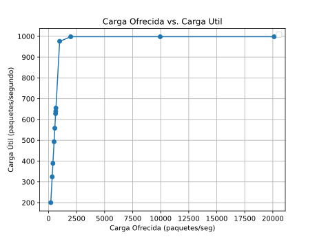

Podemos notar a partir de las tablas una gran similitud. De hecho, las cargas para cada semilla son idénticas en ambos casos. La diferencia radica en lo que sucede internamente en cada cola. Esto se debe a que el cuello de botella en el caso 1 se encuentra en el receptor mientras que el cuello de botella del caso 2 es la cola del medio. Asimismo, tomamos datos para ambos casos bajo tres intervalos de generación: exponencial(0.1), exponencial(0.3) y exponencial(0.15) para el primer caso y exponencial(0.1), exponencial(0.3) y exponencial(0.4) para el segundo. 
Estas métricas fueron elegidas a partir de la tabla, donde notamos a partir de qué semilla la cantidad de paquetes enviados y recibidos son iguales. 

### Conflictos e interpretación de las gráficas: 

## Caso 1: 
exponential(0.1)

    
NodeRx Queue
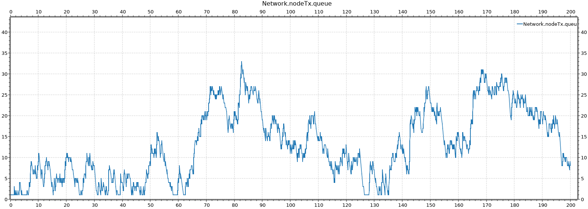
    
NodeTx Queue
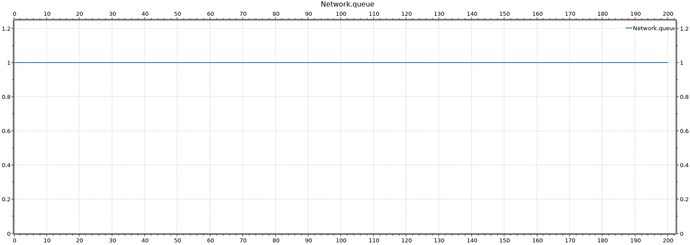
    
Network Queue
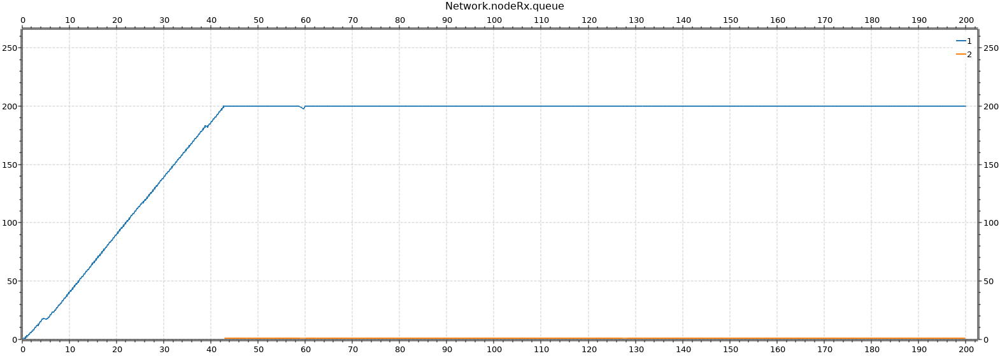

exponential(0.3)

    
NodeRx Queue
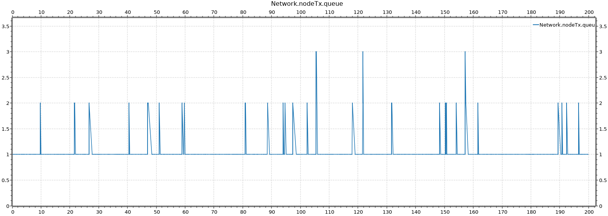
    
NodeTx Queue

    
Network Queue
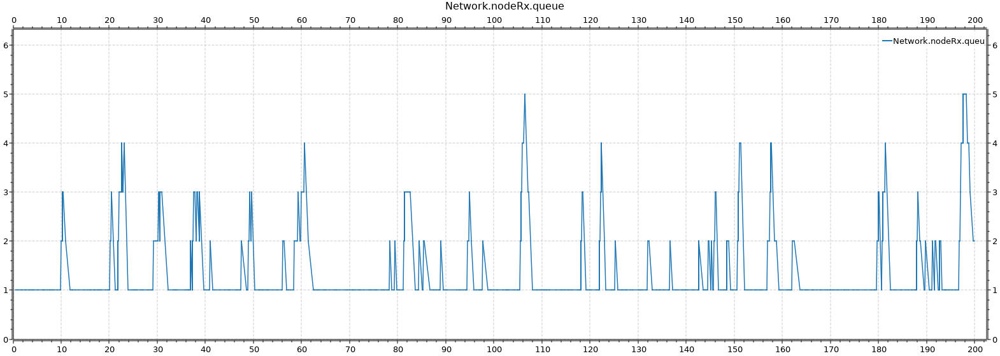

exponential(0.15)

    
NodeRx Queue

    
NodeTx Queue
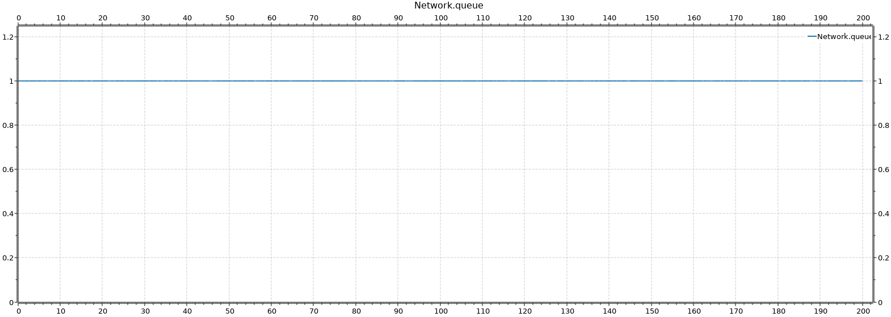
    
Network Queue
> 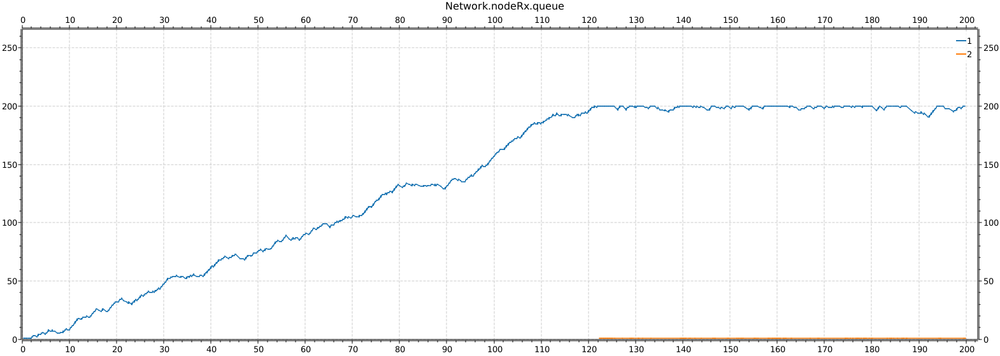

Acá nos interesa analizar el buffer del receptor.
En este caso, cuando el intervalo de generación tiene una distribución exponencial de 0.17, se observa el mejor escenario de los casos analizados. Pasan la mayor cantidad de paquetes sin perderse ninguno, es decir, el mayor aprovechameinto del canal sin saturar al receptor. Sin embargo, a medida que bajamos el intervalo de generación, por ejemplo, con 0.16, podemos observar que algunos paquetes se pierden. Eventualmente, la cola del receptor se llena por completo y el sink (destino) no recibe los paquetes.
El nodo receptor (Rx) tiene una cola que recibe la mayoría de los paquetes que llegan a él. Sin embargo, debido a la saturación de la cola, el buffer de Rx no puede procesar todos los paquetes que le llegan, y aquí se produce un fenómeno conocido como "droppeo", donde algunos paquetes son descartados sin ser procesados. Podemos concluir que este caso se trata de un problema de flujo. Tenemos un emisor rápido, que satura a un receptor lento.

## Caso 2: 
exponential(0.1)

    
NodeRx Queue
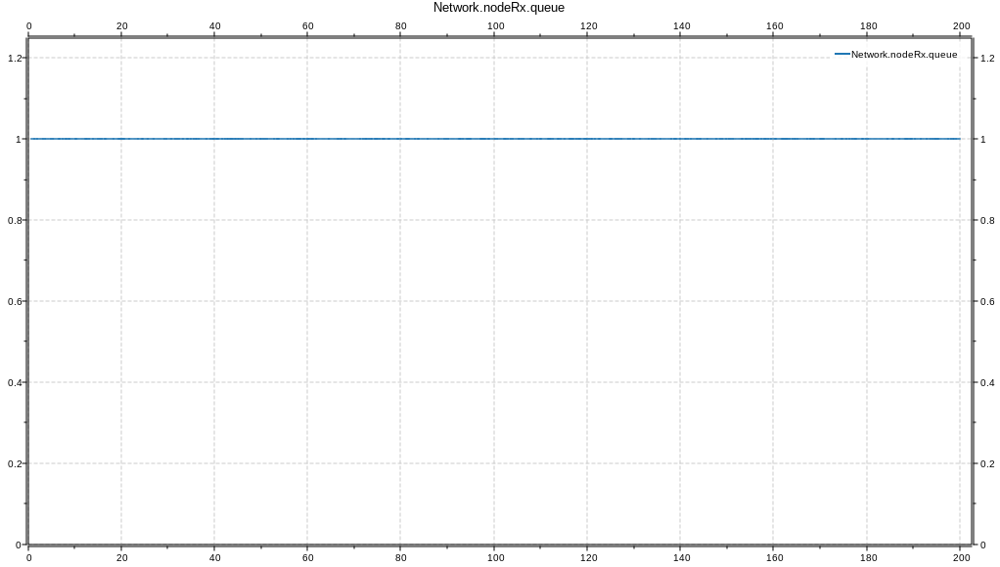
    
NodeTx Queue
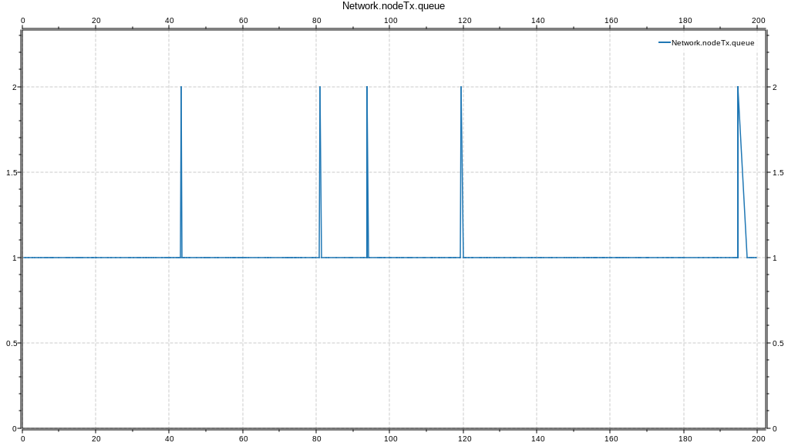
    
Network Queue
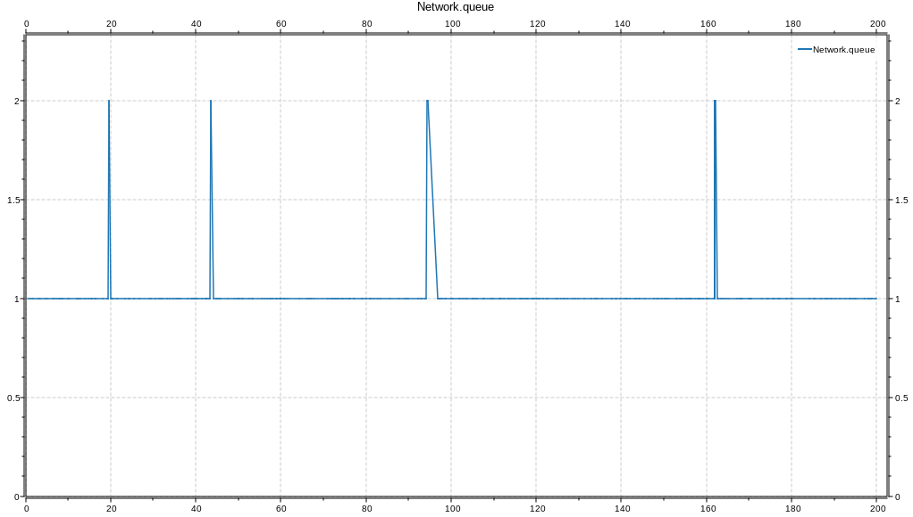

exponential(0.3)

    
NodeRx Queue

    
NodeTx Queue

    
Network Queue

exponential(0.4)

    
NodeRx Queue
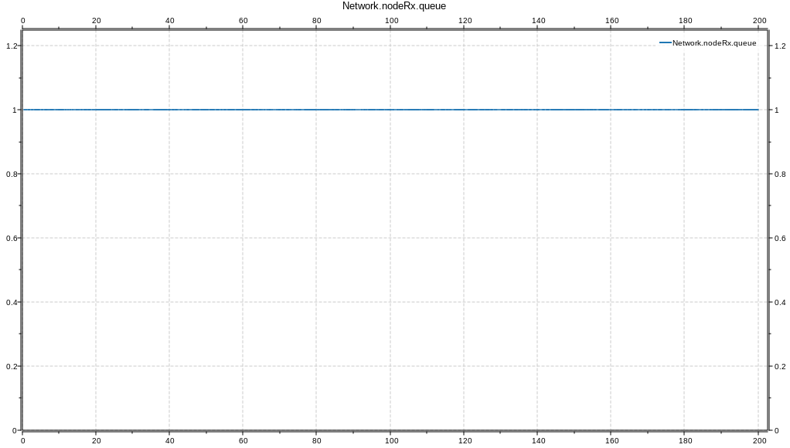
    
NodeTx Queue
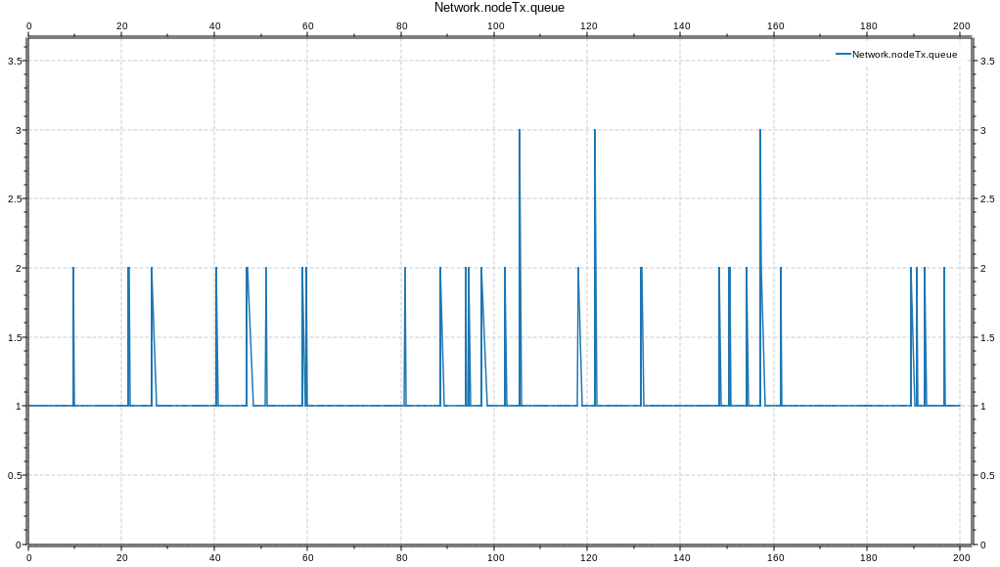
    
Network Queue
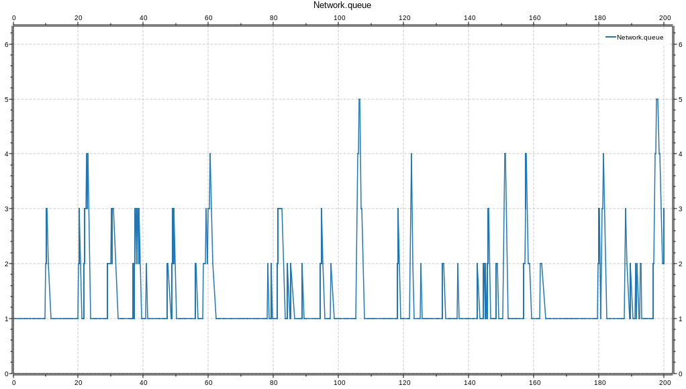

En el escenario analizado, se observa la presencia de un cuello de botella en la red, lo que resulta en problemas de congestión (paquetes que no pueden ser procesados y transmitidos adecuadamente). Cuando la cantidad de paquetes supera un umbral de 200 estos se descartan. 
Esta situación se refleja en el gráfico de "Carga Ofrecida vs Carga Útil", donde ocurre aplanamiento debido a la congestión y la pérdida de paquetes. Además, se identificó que el mejor intervalo de generación de paquetes para optimizar la tasa de transferencia sin pérdida de paquetes fue entre 0.16 y 0.17. Exactamente igual que en el caso 1. Esto no es una mera casualidad, sino que son iguales porque los dos casos de estudio se compensan/son equivalentes en cuanto a la red. Como en el caso 1, tenemos que las velocidades de transmisión de la Queue a Rx, y de Rx a Sink, son 1Mbps y 0.5Mbps respectivamente; mientras que en el caso 2 las velocidades están invertidas. También, como tenemos la misma capacidad de búferes, significa que la cantidad de paquetes transmitidos y perdidos van a ser iguales para cada caso.  
Este escenario de simulación demuestra que existe un cuello de botella en la primera conexión de la red, donde los paquetes llegan rápidamente al nodo intermedio haciendo que la cola se llene, lo que provoca una acumulación de paquetes y congestión en el medio de transmisión. Como resultado, se producen pérdidas de paquetes al medio, lo que afecta el rendimiento y la eficiencia de la red.
Cabe destacar que el emisor se considera lo suficientemente grande como para manejar el tráfico sin generar preocupación por congestión.

### Preguntas primera parte 
- ¿Qué diferencia observa entre el caso de estudio 1 y 2?
El control de flujo y el control de congestión son dos conceptos relacionados pero distintos en el ámbito de las redes de comunicación.
El control de flujo se refiere a los mecanismos utilizados para regular el flujo de datos entre dos dispositivos de red, como por ejemplo, un emisor y un receptor. El objetivo del control de flujo es asegurarse de que el receptor pueda manejar la cantidad de datos enviados por el emisor. Si el receptor no puede procesar los datos lo suficientemente rápido, puede producirse una acumulación de datos en algún punto intermedio, como una cola o buffer. En el caso 1 mencionado, el problema de control de flujo se manifiesta en que los paquetes se pierden en el sink debido a que el NodeRx se llena y no puede procesarlos adecuadamente.
Por otro lado, el control de congestión se refiere a los mecanismos utilizados para evitar la congestión en una red. La congestión ocurre cuando hay una demanda de recursos de red que excede su capacidad disponible. En el caso 2 mencionado, el problema de congestión se produce en la queue intermedia, donde los paquetes se acumulan y su buffer se llena, lo que resulta en una pérdida de paquetes y una reducción del rendimiento de la red.
- ¿Cuál es la fuente limitante en cada uno? Investigue sobre la diferencia entre control de flujo y control de congestión.
En el caso 1, la fuente limitante es NodeRx. Esto significa que los paquetes llegan al NodeRx pero la cola de este nodo se llena y no puede procesarlos adecuadamente, lo que resulta en la pérdida de paquetes en el sink. En este caso, el problema se origina en el control de flujo, ya que la capacidad de procesamiento del NodeRx es insuficiente para manejar la cantidad de paquetes que recibe.
En el caso 2, la fuente limitante es la Queue (cola o buffer) intermedia en la red. Aquí, la mayoría de los paquetes llegan a la cola intermedia, pero debido a que su buffer se llena, los paquetes no pueden ser procesados y se produce una congestión en la red. En este caso, el problema se relaciona con el control de congestión, ya que la capacidad de la cola intermedia es insuficiente para manejar la demanda de paquetes.

## Segunda Parte 

### Análisis de los experimentos 

 
### Caso de estudio 1 : exponential(0.1)

    
TransTx

    
Queue0

    
TransRx
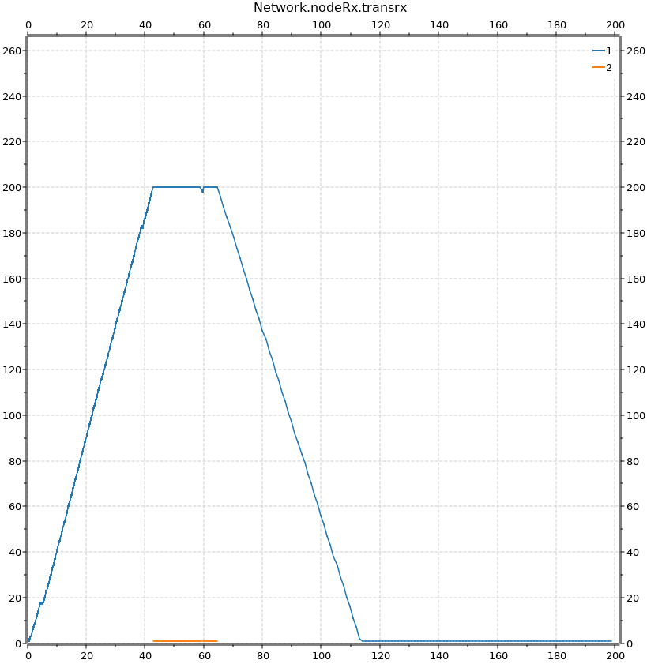

En este caso, los paquetes se generan en un intérvalo de 0.1 lo que implica pérdida de muchos paquetes.
Esto genera que el emisor reciba muchos feedbacks, por lo cual el tiempo para enviar los paquetes aumenta y la cola del emisor se empieza a llenar. 
En los gráficos de TransTx vemos como al final de la simulación la cola se empieza a llenar porque los paquetes se envían más lento de lo que se generan.
Este suceso lo vemos representado el la queue del receptor  al final de la simulación, donde es evidente que la cola se empieza a vaciar rápidamente, es decir, como los paquetes llegan con mayor delay, no se llena la cola y por lo tanto controla la pérdida de paquetes pero desaprovecha el canal. 
Por último, queue0 es constante porque por la configuración dada en network, no genera problemas de flujo ya que el tamaño de su buffer es igual al del emisor. 

### Caso de estudio 2 : exponential(0.2)

    
TransTx

    
Queue0
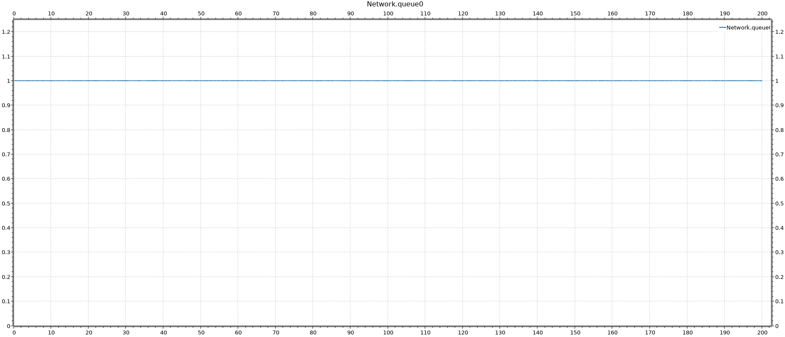
    
TransRx

Para este caso, como el tiempo en que se genera cada paquete es mayor, el receptor tiene más tiempo para procesar los paquetes, por lo tanto, no se genera problema de flujo. Esto se resume en que no hay pérdida de paquetes, pero implica que el canal se desaprovecha.
En los gŕaficos lo vemos reflejado, si analizamos el caso del emisor, la cola no se llena y eso implica que no se recibieron feedbacks. Por el lado del receptor, se muestra que la cola se mantiene entre distintos valores pero no se llena, lo que implica que no se pierden paquetes y por lo tanto no se envían feedbacks.

### Caso de estudio 3 : exponential(0.15)

    
TransTx
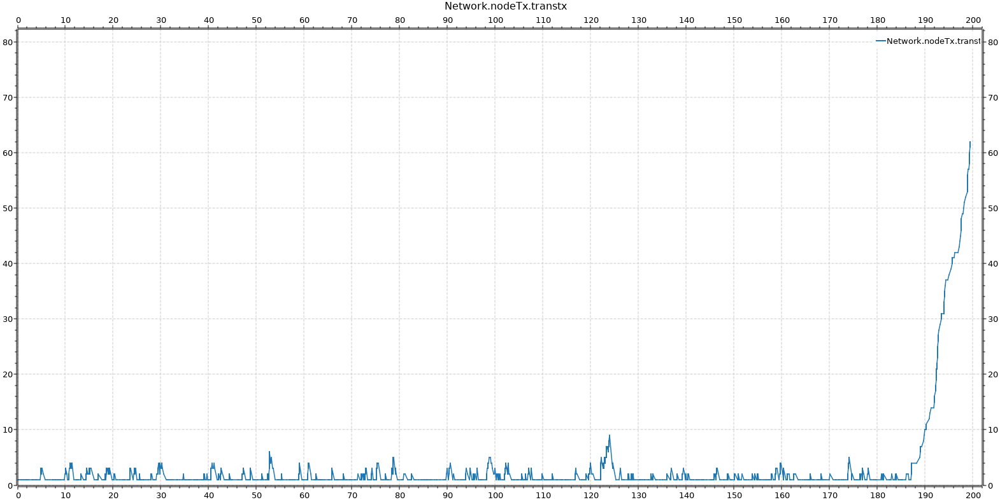
    
Queue0

    
TransRx
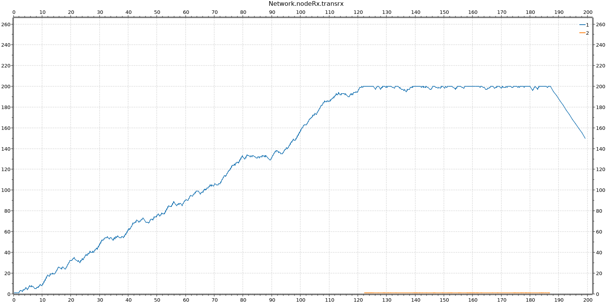
    
Queue1
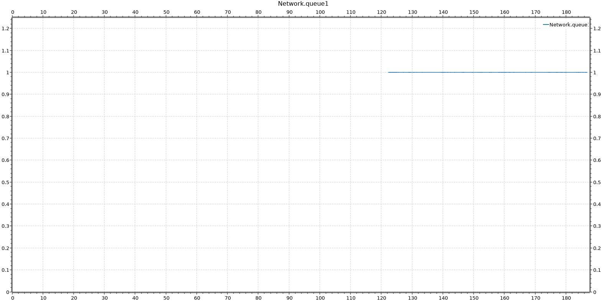

Para este caso, la situación es similar al caso 1, pero como los paquetes se generan con un poco más de delay, el canal tiene mayor aprovechamiento.
Analizando la queue del emisor, se empieza a llenar cerca del final de la simulación, en ese momento se producen pérdidas de paquetes y por lo tanto se envían feedbacks.
A partir de ese momento, se empieza a llenar la cola del emisor para tratar de controlar el flujo y en el receptor se empieza a vaciar la misma. 
En este caso, la queue1 representa la cola de los feedbacks. Vemos que al final de la misma se empieza a llenar, lo que implica que a partir de ese momento se empezaron a enviar paquetes de feedback. 

#### Tabla de datos obtenidos (Segunda Parte)

|Generation Interval | Carga Ofrecida (paquetes/segundo) | Carga Util (paquetes/segundo) |Paquetes Perdidos (paquetes)|
|:------------------:|:---------------------------------:|:-----------------------------:|:--------------------------:|
| exponencial(0.1)	 |		1979	                     |	  645                        |101
| exponencial(0.15)	 | 		1307	                     | 	  1145                       |100
| exponencial(0.2)	 | 		989		                     |	  989                        |0
| exponencial(0.3) 	 | 		659		                     | 	  658                        |0

Con respecto a la pérdida de paquetes, podemos notar que en el primer caso el número descendió considerablemente, pero en el segundo no se nota mucha diferencia. Esto puede llegar a ocurrir por el delay que le sumamos cuando llega un paquete de feedback. En este caso, al ser únicamente 100 paquetes, el retraso que se suma es muy poco y por lo tanto no evita demasiado la pérdida. Podemos concluir entonces, que lo más óptimo sería encontrar un valor tal que funcione para los casos donde hay muchos paquetes de feedback como para los casos en donde hay poco.

### Métodos 
En este caso, decidimos implementar un mecanismo simple para el control de flujo. Usamos la siguiente estrategia: 
El emisor empieza a enviar paquetes al receptor. Cuando el receptor detecta que se llenó su buffer, entonces envía un paquete de feedback al emisor. En el momento en que el emisor lo recibe, a la función scheduleAt le suma un delay, es decir, el mensaje se enviará más lento. Esta idea surge para tratar de bajar la tasa de transmisión. 
Cada vez que llega un feedback nuevo, el delay aumenta. 
Esta decisión la tomamos porque si llegan feedbacks distanciados en tiempo, implica que el receptor necesita recibir los paquetes aún con mayor tiempo entre ellos, por lo tanto el delay es acumulativo y depende de la cantidad de feedbacks que lleguen.
Destacamos que para un buen aprovechamiento del canal para esta segunda parte, la generación de paquetes debe ser entre 0,15 y 0,2 segundos.

### Preguntas segunda parte 
- ¿Cómo cree que se comporta su algoritmo de control de flujo y congestión ? ¿Funciona para el caso de estudio 1 y 2 por igual? ¿Por qué?

El algoritmo de control de flujo parece solucionar el problema, pero no de la mejor manera, ya que puede que ese delay aumente demasiado y se desaproveche el canal. En los datos obtenidos de la primer parte, con un intérvalo de generación de paquetes de 0.1 había pérdida de aprox. 700, con la modificación realizada, ahora se pierden 101.
En este caso, como decidimos implementar el control de flujo únicamente, no analizamos el caso 2 (congestión) porque es trivial que se comportará de la misma manera que en la primer parte del análisis. 
De igual manera, no se deberían comportar igual en los dos casos, pues en el caso donde hay congestión la queue que se llena es la queue0 y por lo tanto hay que regular que ella no dropee paquetes. La diferencia radica en que para solucionar control de flujo el enfoque se pone sobre el emisor/receptor y en cambio en congestión es entre emisor/red. 

### Discusión 
Como conclusión de este trabajo destacamos que pudimos comprender a mayor profundidad el funcionamiento de una red y sus complejidades, cómo y dónde se pueden generar problemas y a partir de ellos proponer una solución que se adapte. Además, pudimos aprender a usar entornos de simulación, a aprovechar sus recursos y utilidades. Por último, este trabajo nos permitió aplicar los conocimientos adquiridos en la materia de manera práctica y así afianzar los conocimientos vistos en el teórico de la materia.

### Referencias 
Andrew S. Tanenbaum (2013) Redes de computadoras.
OMNeT++ Documentation
Videos provistos por la cátedra