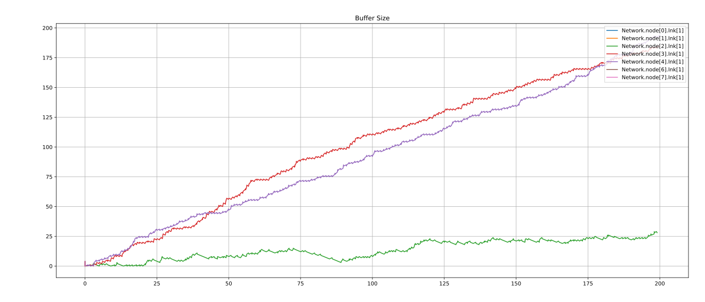

# Informe Laboratorio 4 - Capa de Red

##### Integrantes del grupo: 

- Brunello, Florencia: florenciabrunello@mi.unc.edu.ar
- Caldara, Marí­a Emilia: maemiliacaldara@mi.unc.edu.ar
- Ferrero, Andrés: andres.ferrero@mi.unc.edu.ar

## Índice 
1. [Título](#titulo)
2. [Resumen](#resumen)
3. [Introducción](#intro)
4. [Métricas](#métricas)
5. [Primera Parte](#primera)
6. [Segunda Parte](#segunda)
7. [Métodos](#metodos)
8. [Discusión](#discusion)

## Título 
Análisis de una red con topología de anillo y distintos algoritmos de enrutamiento.

---

## Resumen 
Este laboratorio se centró en simular el comportamiento en una red con topología anillo y analizar la misma utilizando distintos algoritmos de enrutamientos.
Se realizaron mediciones que ayudan a estudiar la utilización la red y sus recursos, y se compararon los resultados obtenidos con distintos algoritmos.

---

## Introducción 
La utilización eficiente de recursos es un aspecto crucial para el rendimiento de las redes. Esta investigación se centra en estudiar la asignación de recursos en una red con una topología en anillo utilizando un algoritmo de enrutamiento. Mediante la simulación de la red y el análisis del comportamiento de diferentes algoritmos de enrutamiento, buscamos comprender cómo se utilizan los recursos de la red e identificar oportunidades de optimización.
En una red con una topología en anillo, los nodos están interconectados de manera circular. El algoritmo de enrutamiento determina la ruta a través de la cual se transmiten los paquetes desde los nodos de origen hasta un nodo receptor central. 
Para investigar la utilización de recursos y el comportamiento del algoritmo de enrutamiento, emplearemos experimentos basados en simulación.
Al replicar condiciones del mundo real y considerar factores como la cantidad de los nodos, el tamaño de los paquetes y la carga de la red, podremos evaluar el rendimiento de varios algoritmos de enrutamiento en escenarios diversos.
Esta investigación tiene los siguientes objetivos:

- Estudiar el efecto de los algoritmos de enrutamiento en la utilización de recursos en redes de topología en anillo. 
- Identificar posibles cuellos de botella y áreas de mejora en la utilización de recursos.
- Proporcionar modificaciones para optimizar los algoritmos de enrutamiento en topologías en anillo.

Al lograr estos objetivos, podemos contribuir a la optimización de redes mediante la mejora del diseño e implementación de protocolos de enrutamiento

---

## Métricas 
Para analizar el funcionamiento del algoritmo se agregaron las métricas: 
- hopCount: Mide los saltos hechos por los paquetes cuando llegan a destino. Los registra a medida que se van recibiendo. 
- deliveryDelay: Mide el tiempo que pasaron encolados los paquetes desde que llegaron a un nodo hasta que se enviaron. Es decir, el tiempo de procesamiento
- hopCountArray: Arreglo con vectores, donde mide cuántos saltos hicieron los paquetes según quién los envió. Permite distinguir por ejemplo que un paquete generado por el nodo 0, tiene 3 saltos.
- bufferSize: Métrica dada por la cátedra. 
- totalDelay: Métrica dada por la cátedra. 

## Primera Parte 
La primera parte de la investigación se basa en analizar los dos casos de estudio dados, utilizando un algoritmo de enrutamiento simple que decide enviar los paquetes hacia la derecha.

### Análisis de los experimentos
 
### <pre>_Caso de estudio 1: Nodo 0 y 2 envían a nodo 5_</pre>
La configuración dada para el primer caso es la siguiente: 

- Network.node[0].app.interArrivalTime = exponential(1)
- Network.node[0].app.packetByteSize = 125000
- Network.node[0].app.destination = 5

- Network.node[2].app.interArrivalTime = exponential(1)
- Network.node[2].app.packetByteSize = 125000
- Network.node[2].app.destination = 5

A continuación, se analizan distintos aspectos de la red, como el uso de la red, la cantidad de saltos que hacen los paquetes, el uso de los bufferes y el tiempo de viaje de los paquetes:

- #### USO DE LA RED: 
    
Uso de la red

En este gráfico se puede ver el funcionamiento del algoritmo de enrutamiento, en este caso los paquetes generados por 2 y 5 se envían por la derecha. Parte de la red no es utilizada eficientemente, los paquetes generados por el nodo2 hacen un recorrido más largo y además hay una sobrecarga en la red pues siempre se usa la misma ruta para enviar paquetes de distintos nodos. 

 

- #### SALTOS:

    
hopCount(1)

    
hopCountFrom(2)

Estos gráficos describen la cantidad de saltos que hacen los paquetes cuando llegan a destino. 
La primera imagen(1) muestra secuencialmente cuántos saltos hicieron los paquetes a medida que llegaban a destino desde los nodos 0 y 2. 
Como el algoritmo de enrutamiento envía los paquetes en sentido horario, vemos que los generados por nodo2 hacen 5 saltos, mientras que los generados por el nodo0 hacen 3 saltos. 
Este métrica muestra que llegan casi alternadamente paquetes desde el nodo0 y el nodo2 y demuestran que el algoritmo dado no es óptimo, pues los paquetes generados por el nodo2 llegarían antes si fuesen enviados por la izquierda, ya que la cantidad de saltos sería menor. 
La segunda imagen(2) muestra el nro. de saltos que hacen los paquetes. En este caso, 3 y 5. 

 

- ####  BUFFERES

    
Bufer0

    
Bufer1

    
Bufer2

Estos gráficos muestran la cantidad de paquetes encolados en cada búffer en los distintos nodos. Los dos primeros gráficos corresponden al nodo0 y nodo1, y se puede visualizar que aumenta la cantidad de paquetes encolados a medida que pasa el tiempo. Esto se debe a que los paquetes generados por el nodo0 y el nodo2 se encolan en el primero de ellos y se van enviando de a uno.
Como consecuencia a esto, vemos a continuación que la demora de envío de los paquetes aumenta. 
Para el nodo2 en cambio, el búfer va modificándose porque únicamente encola los paquetes que son generados él mismo, por lo tanto, en el búffer no se superponen paquetes generados por otro nodo. 

 

- #### DEMORA DE ENVIO:

    
Demora Envío Nodo0

    
Demora Envío Nodo2

En estos gráficos mostramos como varía la demora de envío de los paquetes generados por el nodo0 y el nodo2 respectivamente. En ambos casos, la demora crece linealmente, es decir, los paquetes tardan cada vez más tiempo entre que se encolaron y finalmente se envían. Como se muestra en la sección _Bufferes_, la cantidad de paquetes encolados aumenta, por lo tanto la demora en enviarse será cada vez mayor.

 

- #### DEMORA TOTAL:

    
total(3)

Este gráfico representa las sucesivas demoras de paquetes que llegan a destino. Podemos ver que como la red está sobrecargada, los paquetes se empiezan a encolar en interfaces de los nodos, más específicamente en la capa de enlace, por lo tanto, como se ve en el gráfico, los paquetes que llegan a destino no tienen una demora constante, sino que se van acumulando en los nodos y esta es cada vez mayor. Esta demora se causa principalmente por el algoritmo de enrutamiento elegido. 
Con las métricas 'generados' y 'recibidos', podemos ver que se generaron 390 paquetes y llegaron 196 a destino.
El promedio  fue de 51.15s de demora por paquete ante 196 datos recolectados, registrando un mín de 3s y un máx de 105s.

---

### <pre>_Caso de estudio 2: Todos los nodos envían a nodo 5_</pre>
La configuración dada para el segundo caso es la siguiente:

- Network.node[{0,1,2,3,4,5,6,7}].app.interArrivalTime = exponential(1)
- Network.node[{0,1,2,3,4,5,6,7}].app.packetByteSize = 125000
- Network.node[{0,1,2,3,4,5,6,7}].app.destination = 5

 

- #### USO DE LA RED: 

    
Uso de Red

Para este caso, al igual que el análisis anterior, se puede ver que la red está sobrecargada, pero además vemos que el los paquetes generados por el nodo4 hacen un recorrido muy largo. Esto produce paquetes con muchos saltos y grandes demoras de los mismos antes de llegar a destino, lo cual implica que el algoritmo no es óptimo.

 

- #### SALTOS:

    
hopCount(1)

    
hopCountFrom(2)

Estos gráficos reflejan los saltos en los paquetes. Al comparar con el caso de estudio anterior, como hay más nodos que generen paquetes, hay algunos de ellos que tienen más saltos. Esto se ve reflejado en la figura(2).
Para este caso, los paquetes tienen entre 1 y 7 saltos. Podemos ver que pocos de éstos tienen 7, esto es debido a pierden mucho tiempo encolados en nodos intermedios y son pocos los que llegan a destino. 
También podemos ver que la mayoría de los paquetes que  tienen 1 o 2 saltos y esto se resume en que tienen una demora menor, por lo tanto, es mayor la cantidad de estos paquetes que recibe el nodo5.
Mientras más saltos tenga un paquete, más demora tendrá en llegar a destino.

 

- ####  BUFFERES

    

 
Estos gráficos muestran cómo va aumentando la cantidad de paquetes encolados en los bufferes de los nodos. Como se ve, los paquetes generados por los nodos 2,3,4 son los que más saltos hacen, por lo tanto los búferes de los nodos 1,0,7 por los que pasan los paquetes generados por 2,3,4 estarán más cargados.
Ante esto, podemos ver como crecen a medida que pasa el tiempo, mostrando que mientras transcurre más tiempo, más llenos estarán los bufferes. La única diferencia ocurre con el buffer del nodo 4, el cual no tiene que encolar paquetes generados por otro nodo, por lo tanto su búffer se va a mantener constante. 

- #### DEMORA DE ENVIO:

    

Al igual que en el primer caso y ante el crecimiento de los búferes, los paquetes pasarán más tiempo encolados. Esto lo vemos resumido en los respectivos gráficos de la demora de entrega de cada buffer.

 

- #### DEMORA TOTAL:

    

Este último gráfico resume la demora en la que llegan los paquetes. Con los items analizados podemos concluir que la demora en la llegada de paquetes será cada vez mayor, pues los paquetes demoran más tiempo en enviarse y en los búfferes de los nodos. Al comparar con el caso de estudio anterior, podemos ver que la demora es aún mayor. El promedio obtenido es de 64.53s, con mínimo de 1s y máximo de 184s. 
Al final de la simulación podemos ver la presencia de "picos" en el gráfico, estos picos son generados por los paquetes con mayor cantidad de saltos, pues su demora está relacionada con los saltos.
Además, se obtiene que de los 1378 paquetes generados, llegan 199 a destino, lo cual es un porcentaje menor al 50%.

- #### CONCLUSIÓN PRIMERA PARTE:
Como conclusión al análisis de esta primera parte, se puede ver que efectivamente el algoritmo de enrutamiento no es óptimo ya que la entrega de paquetes se retrasa, aumenta la cantidad de paquetes en bufferes, y por lo tanto el delay total será mayor. 
Todo esto genera que lleguen menos paquetes a destino por su demora, es decir, el porcentaje entre lo que se envía y lo que llega es < 50%. 

- #### Preguntas primera parte
¿Qué métricas se obtienen? ¿Cómo es el uso de los recursos de la red? ¿Se puede mejorar?
Se obtienen las métricas de demora de envío de paquetes, cantidad de saltos que hacen los paquetes, cantidad de paquetes encolados en los bufferes de los nodos, y demora total de los paquetes que llegan a destino, paquetes generados y paquetes recibidos. 
El uso de los recursos de la red no es el adecuado, vemos que la misma se sobrecarga en ciertas zonas. Sería conveniente poder distribuir el envío de paquetes de manera tal que se usen aún más los recursos y se reduzca la demora total.
Se puede mejorar el algoritmo de enrutamiento para que los paquetes lleguen más rápido a destino, y por lo tanto, se reduzca la demora total. Esto puede hacerse con mecanismos que calculen la ruta más corta, y al momento de enviar los paquetes, se elija la más conveniente. 
Con respecto al intervalArrivalTime, en ambos casos de estudio, vemos que si a los paquetes los enviamos con más demora, entonces, la diferencia entre paquetes generados y paquetes recibidos por el nodo 5 es menor, pero a su vez, se desperdicia el uso de la red. 

---

## Segunda Parte 
La segunda parte de la investigación se basa en analizar los dos casos de estudio dados, utilizando un algoritmo de enrutamiento desarrollado por nosotros que elige la ruta dependiendo si la cantidad de saltos al nodo destino (almacenada en netHops) es menor o igual a la mitad del tamaño de la red. 
Este algoritmo toma una decisión de enrutamiento basada en el recuento de saltos hacia el nodo de destino, el cual se encuentra almacenado en el arreglo netHops. La estrategia de enrutamiento consiste en verificar si la cantidad de saltos al nodo de destino es menor o igual a la mitad del tamaño total de la red.

### Análisis de los experimentos

### <pre>_Caso de estudio 1: Nodo 0 y 2 envían a nodo 5_</pre>
La configuración dada para el primer caso es la siguiente: 

- Network.node[0].app.interArrivalTime = exponential(1)
- Network.node[0].app.packetByteSize = 125000
- Network.node[0].app.destination = 5

- Network.node[2].app.interArrivalTime = exponential(1)
- Network.node[2].app.packetByteSize = 125000
- Network.node[2].app.destination = 5

A continuación, se analizan distintos aspectos de la red, como el uso de la red, la cantidad de saltos que hacen los paquetes, el uso de los bufferes y el tiempo de viaje de los paquetes:

- #### USO DE LA RED: 
    
Uso de la red

En este gráfico se ilustra el funcionamiento del algoritmo de enrutamiento que hemos desarrollado. En este caso, los paquetes generados por los nodos 2 y 0 se envían por rutas diferentes. Se puede observar que la distribución de los paquetes en la red es más equitativa, ya que tanto el nodo 2 como el nodo 0 utilizan el camino más corto para alcanzar el nodo 5. Esta distribución equitativa en el enrutamiento contribuye a optimizar la eficiencia de la red, evitando recorridos más largos innecesarios y reduciendo la congestión en la red al distribuir la carga de tráfico de manera más equilibrada. 

 

- #### SALTOS:

    
hopCount

    
hopCountFrom0

    
hopCountFrom2

Estos gráficos describen la cantidad de saltos que hacen los paquetes cuando llegan a destino. La primera imagen muestra secuencialmente cuántos saltos hicieron los paquetes a medida que llegaban a destino desde los nodos 0 y 2. Como el algoritmo de enrutamiento envía los paquetes en la dirección que menos saltos tenga hacia el nodo destino, vemos que los generados por nodo0 y nodo2 hacen 3 saltos, como puede observarse en los dos últimos gráficos. 

 

- ####  BUFFERES

    
Bufer0

    
Bufer2

Estos gráficos muestran la cantidad de paquetes encolados en cada búffer en los distintos nodos. Podemos notar que tanto en el nodo0 y nodo2 el búfer va variando porque únicamente encolan los paquetes que son generados ellos mismos, por lo tanto, en el búffer no se superponen paquetes generados por otro nodo. 
En contraste con lo que ocurría con el algoritmo del kickstart, la demora de envío de los paquetes no aumenta pues en el nodo0 no se encolan paquetes proveninetes de ningún otro nodo y lo mismo ocurre en el nodo2. 
 

- #### DEMORA DE ENVIO:

    
Demora Envío Nodo0

    
Demora Envío Nodo2

En estos gráficos mostramos como varía la demora de envío de los paquetes generados por el nodo0 y el nodo2 respectivamente. En ambos casos, la demora crece linealmente, es decir, los paquetes tardan cada vez más tiempo entre que se encolaron y finalmente se envían. Como se muestra en la sección _Bufferes_, la cantidad de paquetes encolados aumenta, por lo tanto la demora en enviarse será cada vez mayor.

 

- #### DEMORA TOTAL:

Este gráfico representa las sucesivas demoras de paquetes que llegan a destino. Al contrario del algoritmo de enrutamiento provisto en el kickstart, podemos ver un mejor aprovechamiento de la red ya que los paquetes no se encolan en gran medida como antes, sino que el nodo0 y nodo2 envían sus paquetes por rutas diferentes. Asimismo, vemos que la demora total disminuyó al analizar la métrica TotalDelay, donde en el escenario 1, puede verse que el promedio era mayor (63.6693s) mientras que con nuestro algoritmo fue de 6.904s. Con las métricas 'generados' y 'recibidos', podemos ver que se generaron 390 paquetes y llegaron 379 a destino, lo cual implica una gran mejora en comparación al escenario 1. 

---

### <pre>_Caso de estudio 2: Todos los nodos envían a nodo 5_</pre>

- #### USO DE LA RED: 
    

En este caso podemos notar una gran diferencia con el algoritmo estudiado anteriormente, en este caso, los paquetes generados por los nodos 2, 3 y 4 hacen menos cantidad de saltos, por ende es más óptimo. Esto se debería ver reflejado en los análisis posteriores. 

 

- #### SALTOS:

    
hopCount(1)

    
hopCountFrom(2)

A partir de estos gráficos podemos ver que la cantidad máxima de saltos que hacen los paquetes es 4. El algoritmo de la primer parte hacía 7 saltos.
Esta métrica evidencia el funcionamiento del algoritmo y funciona como lo esperado. 

 

- ####  BUFFERES

    
bufLnk[0]

    
bufLnk[1]

 
Este caso es diferente al caso anterior, donde los paquetes al enviarse por la derecha, el búfer Lnk[1] no guardaba paquetes. Para este algoritmo, como los paquetes van a elegir el camino más corto por el que pueden ir al destino, se va a usar tanto el búfer Lnk[0] como Lnk[1]. 
En el gráfico de la izquierda podemos ver que los nodos que usan el búfer Lnk[0] son 0,1,6,7. Esto es porque para estos nodos, lo más conveniente es que los paquetes se envíen por la derecha.
A si mismo, el búfer Lnk[1] es usado por los nodos 2,3,4 porque es más conveniente que los paquetes generados por ellos sean enviados por la izquierda. 
De acuerdo a esto, el uso de los búferes está más distribuído y no se sobrecarga la red en una parte específica. Registraron un máximo de aprox. de 200 paquetes encolados. El máximo en el primer algoritmo superaba los 200 paquetes.

- #### DEMORA DE ENVIO:

    
deliveryDelayLnk[0]

    
deliveryDelayLnk[1]

No hubo diferencias significativas con respecto al tiempo de demora de entrega en ambos algoritmos.

- #### DEMORA TOTAL:

    

Los datos obtenidos de demora total registra un promedio de 63.66s, con un máximo de 166s. De 1378 paquetes generados, 398 se recibieron. 
En esta métrica podemos ver reflejado el cambio que generó el algoritmo, donde no se produjo mucha demora en los paquetes porque los búferes no estaban tan usados, y el destino al poder recibir paquetes desde dos lugares distintos hizo que aumente el nro. al doble. 

- #### CONCLUSIÓN SEGUNDA PARTE:
Podemos concluir de esta segunda parte que el algoritmo produjo una mejora de métricas y por lo tanto es más óptimo. Esta mejora fue generada porque el uso de la red está más distribuído y porque los saltos de los paquetes se redujeron. 

- #### Preguntas segunda parte
Además de todo el análisis planteado anteriormente, podemos asegurar que no hay loops de enrutamiento y que el algoritmo funciona bien.
En cuanto a mejoras, podríamos incorporar el factor tiempo (demora/retardo aproximado a cada nodo) ya que interpretar la distancia como cantidad de saltos es bastante limitado. También podríamos tener en cuenta la carga de la red, ya que puede haber casos en las que un camino sea un poco más largo que la mitad de la red, pero más rápido porque hay menos carga.

## Métodos 
- Nos centramos en ver la ruta/distancia más corta como "menor cantidad de saltos" para llegar a otro nodo.

- Al inicializarse cada nodo, manda un paquete "hello" a través de la red en sentido horario, que da toda la vuelta a la red hasta llegar de nuevo a sí mismo. Al mismo tiempo, cada nodo que va recibiendo y reenviando ese paquete hello por la red, incrementando el hopCount en 1. Por otro lado, manda de nuevo hacia el nodo de origen (en sentido antihorario) un paquete tipo "echo" (o de feedback), que contiene la cantidad de saltos que llevaba el paquete hello en ese momento. De esta manera, sabemos cuántos saltos hay desde el nodo origen, hacia ese nodo que manda el feedback.

- Una vez que estos feedbacks (va a llegar uno por cada nodo) lleguen al nodo origen, este lo guarda en un arreglo, entonces tenemos la distancia (cantidad de saltos) a cada nodo desde el nodo que queremos mandar un paquete desde la aplicación.

- También, cuando el paquete hello, dé toda la vuelta a la red, nos guardamos el tamaño de la red en base al hopCount que trajo ese paquete, es decir, la cantidad de saltos+1 significa cuántos nodos tiene mi red.

- Ahora, en base a estos datos, ya tenemos el tamaño de la red, y la distancia a cada otro nodo de la red en sentido horario. Entonces, a partir de esto, decidimos, por ejemplo, si el nodo 0 quiere mandar un paquete de datos al nodo 3, chequemos si la distancia al nodo 3 (dada en el arreglo) es <= tamañoDeRed/2. En caso afirmativo, mandamos el paquete en sentido horario. Caso contrario (distancia > tamañoRed/2), enviamos en sentido antihorario, porque sabemos que vamos a tener menos saltos por ese lado de la red.

## Discusión 
Como conclusión de este trabajo destacamos que pudimos comprender a mayor profundidad el funcionamiento de una red y sus complejidades, cómo y dónde se pueden generar problemas en el tráfico en la red en base a una topología determinada. Por último, este trabajo nos permitió aplicar los conocimientos adquiridos en la materia de manera práctica y así afianzar los conocimientos vistos en el teórico de la materia.

Referencias
Andrew S. Tanenbaum (2013) Redes de computadoras. 
OMNeT++ Documentation.
Videos provistos por la cátedra.